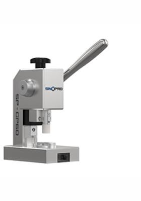
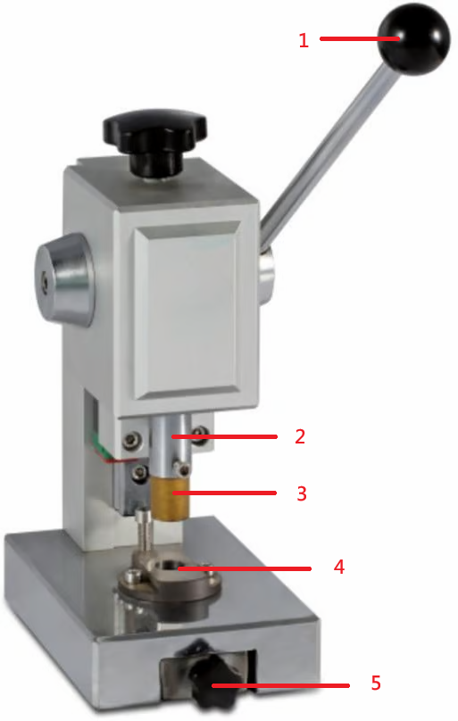
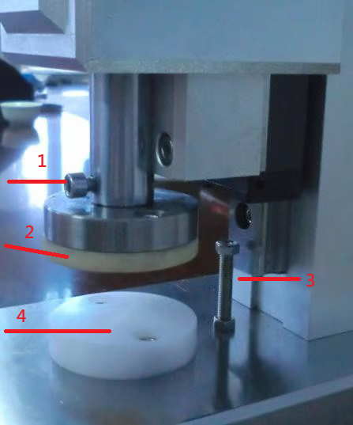
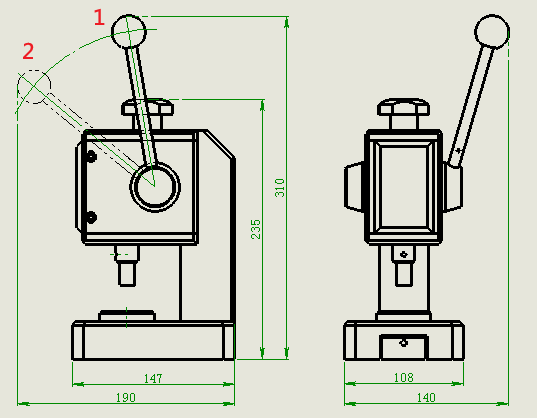
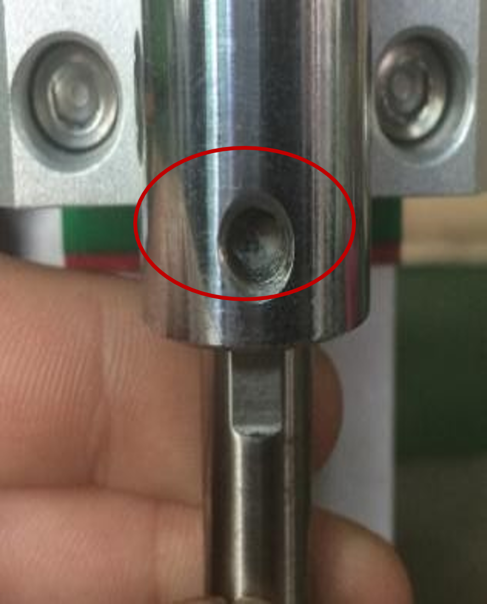

# SP-CP60 Button Battery Punching Machine

> **SINOPRO** · 문서 번호 SINOPRO-M-SP-CP60 · Rev. 1.0 · 2026. 08.


본 매뉴얼은 SP-CP60 Button Battery Punching Machine의 조작·유지관리 방법을 설명합니다. 장비를 사용하기 전에 **2. 안전 및 주의사항**을 반드시 확인하시기 바랍니다.


## 1. 장치 정보

### 1-1. 장치 개요

배터리 실험 및 제작 시 양극, 음극 전극 시트와 분리막을 원하는 크기로 정밀하기 절단하는 장치 입니다.

### 1-2. 장치 구성

**그림 1 — 펀칭부 구성**

<table><thead><tr><th width="142.75" align="center">번호</th><th>명칭</th></tr></thead><tbody><tr><td align="center">1</td><td>핸드 레버</td></tr><tr><td align="center">2</td><td>주축</td></tr><tr><td align="center">3</td><td>상부 펀치</td></tr><tr><td align="center">4</td><td>하부 다이</td></tr><tr><td align="center">5</td><td>아크릴 박스</td></tr></tbody></table>

**그림 2 — 커터부 구성**

<table><thead><tr><th width="142.75" align="center">번호</th><th>명칭</th></tr></thead><tbody><tr><td align="center">1</td><td>커터 고정 나사</td></tr><tr><td align="center">2</td><td>상부 커터</td></tr><tr><td align="center">3</td><td>리미트 조절 볼트</td></tr><tr><td align="center">4</td><td>하부 받침대</td></tr></tbody></table>

**핸드 레버 위치**

1. 핸드 레버 초기 위치 / 2. 핸드 레버 타발 위치

### 1-3. 장치 사양 및 규격&#x20;

<table><thead><tr><th width="199">항목</th><th>사양</th></tr></thead><tbody><tr><td>타발 사이즈</td><td>기본 Φ14mm / 옵션 Φ8~Φ24mm (고객 요청에 따라 선택 가능)</td></tr><tr><td>타발 스트로크</td><td>25mm</td></tr><tr><td>외형 치수</td><td>L110 × W150 × H235mm</td></tr><tr><td>글러브박스 반입</td><td>직경 Φ200mm 이상의 글러브박스 패스박스를 통해 반입 가능합니다. (그림 3 참조)</td></tr><tr><td>중량</td><td>약 8kg</td></tr></tbody></table>

## 2. 안전 및 주의사항

### 2-1. 경고 표지 및 기호 설명


**위험 (DANGER)** — 지시를 따르지 않을 경우 사망 또는 중상으로 이어질 수 있는 임박한 위험 상황입니다.



**경고 (WARNING)** — 지시를 따르지 않을 경우 사망 또는 중상으로 이어질 수 있는 잠재적 위험 상황입니다.



**주의 (CAUTION)** — 지시를 따르지 않을 경우 경상 또는 장비 손상으로 이어질 수 있는 상황입니다.


### 2-2. 작업자 안전 수칙

_(원본 문서에 해당 내용 없음)_

### 2-3. 설치 환경 주의사항

_(원본 문서에 해당 내용 없음)_

## 3. 설치 및 운반

### 3-1. 운반 및 이동

_(원본 문서에 해당 내용 없음)_

### 3-2. 유틸리티 연결

_(원본 문서에 해당 내용 없음)_

## 4. 사용 및 조작 방법

### 4-1. 사용 전 준비사항

* 설치 공간: 글러브박스 패스박스 직경은 Φ200mm 이상이어야 하며, 핸드 레버를 분리하여 장치를 내부로 반입할 수 있습니다.
* 금형 장착: 상부 펀치 또는 커터의 평면부를 주축 나사 홀에 맞춰 장착하며하부 금형과 위치를 맞춘 후 좌우 고정 나사를 균일하게 조입니다.
* 스트로크 조절: 커터 사용 시 상단의 리미트 조절 볼트로 하강 깊이를 조절하여 커터가 하부 받침 블록에 직접 부딪히지 않도록 합니다.
* 무부하 테스트: 금형 장착 후 핸드 레버를 5\~10회 작동하여 펀치가 하부 다이에 걸림이나 이상음 없이 원활하게 작동하는지 확인합니다.
* 소재 장착: 분리막, 동박·알루미늄박 및 전극은 하부 다이 중앙에 평평하게 올려놓고, 금형의 작업 범위를 벗어나지 않도록 합니다.

### 4-2. 장비 조작

#### 펀칭 작업 방식



## 타발할 소재를 하부 다이 위에 올려놓습니다

그림 1과 같이 타발할 소재를 하부 다이 위에 올려놓습니다.



## 핸드 레버를 작동합니다

핸드 레버를 작동시키면 상부 펀치가 하강하여 하부 다이 내부로 진입하면서 소재가 타발됩니다.



## 아크릴 박스를 꺼냅니다

타발 후 아크릴 박스를 꺼내면 작업이 완료됩니다.




**주의**: 상부 펀치가 하부 다이 내부로 원활하게 진입하지 않을 경우 무리하게 힘을 주어 작동하지 않습니다. 과도한 힘을 가하면 펀치 날이 손상될 수 있습니다.&#x20;

이 경우 아래의 펀치형 다이 정렬 방법에 따라 정렬 작업을 진행해야합니다.


#### 펀치형 다이 정렬방법



## 상부 펀치를 장착합니다

먼저 상부 펀치를 장착합니다.



## 상부 펀치 평면부를 맞춥니다

그림 1-1과 같이 상부 펀치의 평면부를 나사 구멍에 맞춥니다.



## 상부 펀치 위치를 맞추고 고정 나사를 체결합니다

핸드 레버를 작동하여 상부 펀치를 천천히 내리고 하부 다이 상면에 가볍게 닿도록 합니다. 상부 펀치의 단면과 주축 단면이 밀착되도록 위치를 맞춘 후 고정 나사를 체결합니다. (그림 2-2)



## 상부 펀치의 진입 위치를 조정합니다

핸드 레버를 천천히 작동하여 상부 펀치가 하부 다이 내부로 가볍게 진입하도록 위치를 조정합니다. 상부 펀치가 하부 다이 내부에서 부드럽게 움직이는지 확인하면서 좌우 고정 나사를 번갈아 조금씩 균일하게 조여 고정합니다.



## 정렬 상태를 확인합니다

정렬 후 핸드 레버를 가볍게 작동하여 상부 펀치가 하부 다이에 걸림 없이 부드럽게 진입하는지 확인합니다. 걸림이 있을 경우 다시 정렬합니다.



## 탄성 언로딩 링을 장착합니다

마지막으로 탄성 언로딩 링을 장착합니다.



.jpeg>)


▲ **주의**: 다이 정렬 중에는 무리하게 힘을 주어 타발하지 않습니다.&#x20;

과도한 힘을 가하면 펀치 날이 손상될 수 있습니다.


#### 커터 방식 타발


▲ **주의**: 분리막(Separator)을 절단할 경우, 분리막 아래에 반드시 A4 용지 1장을 깔고 작업합니다.




## 소재와 A4 용지를 하부 받침 블록 위에 올려놓습니다

그림 2와 같이 타발할 소재 아래에 A4 용지 1장(약 0.1mm 두께)을 깔고 하부 받침 블록 위에 올려놓습니다.



## 핸드 레버를 작동합니다

핸드 레버를 작동시키면 상부 커터가 하강하여 소재를 절단합니다. 절단이 완료되면 제품을 꺼냅니다.



#### 커터 금형 정렬 방법



## 상부 커터를 장착합니다

먼저 상부 커터를 장착합니다.



## 상부 커터 평면부를 맞춥니다

상부 커터의 평면부를 고정 나사 구멍에 맞춥니다.



## 상부 커터 위치를 맞춥니다

핸드 레버를 천천히 작동하여 상부 커터를 내리고 하부 받침 블록 상면에 가볍게 닿도록 위치를 맞춥니다.



## 커터 고정 나사를 조여 고정합니다

상부 커터의 단면과 주축 단면이 밀착된 상태에서 커터 고정 나사를 조여 고정합니다.



## 하부 받침 블록을 장착합니다

하부 받침 블록을 장착한 후 고정 나사를 체결합니다.



## 시험 절단을 진행합니다

소재를 올려놓고 핸드 레버를 작동하여 시험 절단을 진행합니다. 소재가 완전히 절단되고 하부 받침 블록 표면에 칼자국이 없거나 아주 미세하게 남는 상태가 적정 상태입니다.



## 리미트 조절 볼트로 하강 높이를 맞춥니다

상부 커터의 하강 거리가 부족하여 소재가 완전히 절단되지 않을 경우 리미트 조절 볼트를 조정하여 하강 높이를 맞춥니다.




※ **주의**: 상부 커터가 하부 받침 블록을 과도하게 누르지 않도록 조정합니다. 과도하게 내려갈 경우 커터 날과 하부 받침 블록이 손상될 수 있습니다.


### 4-3. 사용 후 정리

_(원본 문서에 해당 내용 없음)_

## 5. 유지보수 및 트러블슈팅

### 유지관리 및 주의사항

* 사용 후에는 깨끗한 천에 알코올을 묻혀 금형과 장치 외부를 깨끗이 닦습니다. 장기간 사용하지 않을 경우에는 방청유를 얇게 도포하여 녹이 발생하지 않도록 합니다.
* 슬라이드 축 등 구동 부위는 정기적으로 청소하여 이물질이 끼지 않도록 하고, 윤활유를 도포하여 원활하게 작동하도록 관리합니다.
* 볼트, 너트, 핀 등 체결 부위는 정기적으로 점검하여 풀림이 없는지 확인합니다. 체결부가 풀린 상태로 사용할 경우 장치 고장 또는 안전사고의 원인이 될 수 있으므로 이상이 있을 경우 즉시 점검합니다.

### 5-1. 정기 점검 항목



* 펀치·커터·금형 청소
* 전극·분리막 잔여물 제거
* 금형 정렬 및 작동 상태 확인
* 미사용 시 금형 방청유 도포



* 가이드·주축 윤활 상태 점검
* 고정 나사 풀림 점검
* 펀치·커터 날 마모 상태 점검
* 탄성 언로더 링 상태 점검



* 금형 분리 및 세척
* 금형 방청유 도포
* 장치 방진 보관
* 재사용 전 구동부·체결부 점검



### 5-2. 주요 소모품 및 부품 교체

* **펀치 + 하부 다이**
  * 교체 주기: 고빈도 사용 시 약 **3\~6개월**
  * 날 손상 또는 절단면에 과도한 버가 발생할 경우 세트로 교체합니다.
  * 규격: Φ8\~Φ24mm 선택 가능
* **커터 + 탄성 언로더 링**
  * 교체 주기: 약 **4\~7개월**
  * 분리막 절단용 소모품으로, 커터 날이 무뎌지거나 탄성 언로더 링의 탄성이 저하된 경우 교체합니다.
* **주축 윤활 그리스**
  * 보충 주기: **월 1회**
  * 주축 및 슬라이드 부위의 움직임이 뻑뻑하거나 걸림이 있을 경우 추가로 도포합니다.
* **리미트 조절 볼트 / 고정 나사**
  * 일반 규격 부품으로, 나사산이 마모되거나 손상된 경우 교체합니다.

### 5-3. 트러블슈팅

| 고장현상                             | 고장원인                                                                                        | 해결방법                                                                                                          |
| -------------------------------- | ------------------------------------------------------------------------------------------- | ------------------------------------------------------------------------------------------------------------- |
| 펀치가 내려가지 않거나 작동 중 걸림             | 

<ol><li>펀치와 하부 다이의 정렬 불량</li><li>가이드부 오염 또는 윤활 부족</li></ol>                          | 

<ol><li>금형을 다시 정렬한 후 고정 나사를 균일하게 조입니다.</li><li>가이드부를 청소하고 윤활유를 도포한 후 무부하 상태에서 반복 작동합니다.</li></ol>      |
| 소재가 완전히 절단되지 않거나 절단면에 버가 심하게 발생함 | 

<ol><li>펀치 또는 커터 날의 마모·손상</li><li>분리막 절단 시 A4 용지를 사용하지 않음</li><li>금형 정렬 불량</li></ol> | 

<ol><li>날을 연마하거나 금형을 교체합니다.</li><li>분리막 아래에 반드시 A4 용지 1장을 깔고 작업합니다.</li><li>금형 위치를 다시 조정합니다.</li></ol> |
| 타발 후 펀치가 하부 다이에 끼어 복귀하지 않음       | 탄성 언로더 링의 노후 또는 변형                                                                          | 탄성 언로더 링을 교체한 후 금형을 다시 정렬합니다.                                                                                 |
| 타발 위치가 틀어지거나 위치가 정확하지 않음         | 베이스 고정 노브 또는 금형 고정 나사 풀림                                                                    | 체결부를 모두 조인 후 금형 위치를 다시 조정합니다.                                                                                 |

## 6. 기술지원 (A/S)

### 6-1. A/S 접수 절차 및 문의처



## 장비 정보 확인

장비 모델명(SP-CP60)과 **시리얼 번호**를 확인합니다.



## 문의처로 연락

이상 현상을 확인한 후 아래 문의처로 연락합니다. 이상 현상 사진/영상을 함께 보내 주시면 처리가 빠릅니다.



| 구분 | 내용 |
| -- | -- |
|    |    |
|    |    |
|    |    |
|    |    |

### 6-2. 품질 보증 기간 및 조건

| 구분 | 기간 |
| -- | -- |
|    |    |
|    |    |
