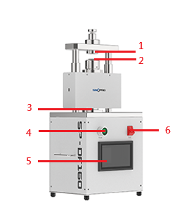
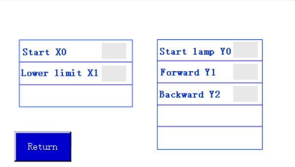

# SP-DF160 Button Battery Electric Crimping Machine

> **SINOPRO** · 문서 번호 SINOPRO-M-SPDF160 · Rev. 1.0 · 2026. 08.


본 매뉴얼은 SP-DF160 Button Battery Electric Crimping Machine의 조작·유지관리 방법을 설명합니다. 장비를 사용하기 전에 **2. 안전 및 주의사항**을 반드시 확인하시기 바랍니다.


## 1. 장치 정보

### 1-1. 장치 개요

본 장치는 실험실에서 코인셀 및 커패시터 시료를 제작할 때 실링 작업에 사용하는 전동 크림핑 장치이며, 소량 시험 생산에도 사용할 수 있습니다.

기본 금형은 20 시리즈 코인셀에 사용할 수 있으며, 일부 금형 부품을 교체하면 2450, 2430 등 다양한 규격의 코인셀 실링 및 분해 작업이 가능합니다.

또한 용도에 맞는 금형으로 교체할 경우 건식·습식 분말 압착, 성형 및 리벳팅 작업에도 사용할 수 있습니다.

### 1-2. 장치 구성

**그림 1 — 장치 구성**

<table><thead><tr><th width="129">번호</th><th>명칭</th></tr></thead><tbody><tr><td>1</td><td>상부 실링 금형</td></tr><tr><td>2</td><td>셀 안착 지그</td></tr><tr><td>3</td><td>실링 슬라이드 구동부</td></tr><tr><td>4</td><td>전원 스위치</td></tr><tr><td>5</td><td>터치스크린</td></tr></tbody></table>

### 1-3. 장치 사양 및 규격&#x20;

<table><thead><tr><th width="285">항목</th><th>사양</th></tr></thead><tbody><tr><td>실링 압력</td><td>디지털 표시 및 압력값 설정 가능, Max. 1,200 kg</td></tr><tr><td>전원</td><td>단상 AC 220V ±10%, 50/60Hz</td></tr><tr><td>소비전력</td><td>100W</td></tr><tr><td>실링 스트로크</td><td>20mm</td></tr><tr><td>기본 실링 금형</td><td>CR20 시리즈용 (CR2016, CR2025, CR2032)</td></tr><tr><td>옵션 금형</td><td>기타 규격 금형 선택 가능</td></tr><tr><td>외형 치수</td><td>L250 × W190 × H560mm</td></tr><tr><td>중량</td><td>약 20kg</td></tr></tbody></table>

## 2. 안전 및 주의사항

### 2-1. 경고 표지 및 기호 설명


**위험 (DANGER)** — 지시를 따르지 않을 경우 사망 또는 중상으로 이어질 수 있는 임박한 위험 상황입니다.



**경고 (WARNING)** — 지시를 따르지 않을 경우 사망 또는 중상으로 이어질 수 있는 잠재적 위험 상황입니다.



**주의 (CAUTION)** — 지시를 따르지 않을 경우 경상 또는 장비 손상으로 이어질 수 있는 상황입니다.


### 2-2. 작업자 안전 수칙


**안전 작업** — 가압 실링 또는 분해 작업 중에는 금형 압착 영역에 손을 넣지 않습니다. 2인 이상이 동시에 조작하지 않으며, 릴리프 압력은 임의로 조절하지 않습니다. 압력 조정이 필요한 경우 제조사에 문의하며 200kg/cm²를 초과하여 설정하지 않습니다.


* 작업자는 정전기 방지 손목밴드 및 손가락 골무를 착용하여 정전기로 인한 배터리 성능 및 수명 저하를 방지합니다.

| 보호구         | 착용 시점   |
| ----------- | ------- |
| 정전기 방지 손목밴드 | 장치 작동 전 |
| 손가락 골무      | 장치 작동 전 |

### 2-3. 설치 환경 주의사항

* **설치 환경** — 장치는 평평하고 견고한 작업대에 수평으로 설치합니다. 글러브박스 내부에서 사용할 경우 장치 크기 232 × 190 × 330mm 및 중량 30kg을 고려하여 충분한 설치 공간이 확보되어 있는지 확인합니다.
* **진동** — 장치 주변에 진동이 발생하는지 확인하고, 진동으로 인해 배터리 실링 정밀도에 영향을 주지 않도록 합니다.

## 3. 설치 및 운반

### 3-1. 운반 및 이동

_(원본 문서에 해당 내용 없음)_

### 3-2. 유틸리티 연결

_(원본 문서에 해당 내용 없음)_

## 4. 사용 및 조작 방법

### 4-1. 사용 전 준비사항

**장치 작동 전 준비사항**

* 작업자는 정전기 방지 손목밴드 및 손가락 골무를 착용하여 정전기로 인한 배터리 성능 및 수명 저하를 방지합니다.
* 장치 주변에 진동이 발생하는지 확인하고, 진동으로 인해 배터리 실링 정밀도에 영향을 주지 않도록 합니다.

**장치 설정 전 주의사항**

* **금형 조립** — 먼저 하부 금형을 장착하고 이젝터를 핀 홀에 맞춰 고정한 후, 상부 금형을 장착하여 위치 결정 링을 맞추고 고정합니다. 조립 후에는 반드시 무부하 상태에서 시험 가압하여 걸림이 없는지 확인한 후 사용합니다.
* **실링 높이 조절** — 리미트 너트 측면의 세트 스크류 4개를 풀고 너트를 돌려 실링 높이를 조절합니다. 조절 후 세트 스크류를 다시 조여 고정하여 연속 작업 시 실링 높이가 달라지지 않도록 합니다.
* **압력 사전 점검** — 무부하 상태에서 핸드 레버를 작동했을 때 압력계가 80\~100kg/cm²까지 상승하면 출고 기준상 정상입니다.
* **유압 시스템 점검** — 사용 전 누유 여부와 유압유 레벨을 확인합니다. 언로딩 밸브를 반시계 방향으로 풀어 금형이 완전히 열리는지 확인합니다.


**주의**: 특수 작업 조건으로 더 높은 압력이 필요한 경우 반드시 제조사에 문의하여 릴리프 밸브 조정값을 확인하며 임의로 압력을 높이지 않습니다.


### 4-2. 장비 조작



전원을 켜면 해당 화면이 표시됩니다. 화면을 터치하면 다음 화면으로 이동합니다.

해당 화면에서 ‘Pressure setting’을 선택하면 현재 압력 값을 설정할 수 있습니다.

해당 화면에서 ‘Pressure setting’을 누르면 현재 압력값을 설정할 수 있습니다. 설정 후 다음 화면으로 이동합니다.

해당 화면에서 압력 값을 수정한 후 ENTER를 눌러 확인하고 이전 화면으로 돌아가면 됩니다.

IO신호 표시 화면입니다.

<figure><figcaption></figcaption></figure>





### 전원 연결

* 전원 케이블을 연결합니다.
* 장치의 전원 스위치를 켜면 터치스크린에 조작 화면이 표시됩니다.



### 셀 장착

* 실링할 코인셀을 셀 안착 지그에 넣고 음극(-)이 위로 향하도록 수평으로 올려놓습니다.
* 코인셀 규격에 따라 셀 안착 지그의 높이를 조절하여 적절한 실링 위치에 맞춥니다.



### 셀 실링

* 터치스크린에서 해당 코인셀의 실링 압력값을 설정한 후 【ENTER】를 눌러 적용합니다.
* 작동 버튼을 누르면 실링 슬라이드 구동부가 상승하여 상부 실링 금형과 맞물리면서 실링이 진행됩니다.
* 설정된 압력에 도달하면 실링이 완료되고, 실링 슬라이드 구동부가 자동으로 하강하여 초기 위치로 복귀합니다.



### 셀 꺼내기

* 실링이 완료된 코인셀을 꺼냅니다.
* 동일한 규격의 코인셀을 연속으로 실링할 경우 작동 버튼을 눌러 다음 작업을 진행합니다.
* 다른 규격의 코인셀로 변경할 경우 셀 안착 지그의 높이를 다시 조절한 후 작업을 진행합니다.





### 4-3. 사용 후 정리

_(원본 문서에 해당 내용 없음)_

## 5. 유지보수 및 트러블슈팅

### 유지보수 및 주의사항

* **일상 청소** — 사용 후 부드러운 천에 알코올을 묻혀 실링 금형 및 분해 금형을 닦고 금속 가루나 전해액 잔여물을 제거하여 금형 표면을 깨끗하게 유지합니다.
* **구동부 윤활** — 볼 가이드 포스트 및 가이드 부시 등 직선 구동부에 정기적으로 윤활유를 도포하여 원활하게 승강할 수 있도록 관리합니다.
* **장기간 미사용 시** — 장치를 깨끗하게 청소한 후 움직이는 금속 부위에 방청유를 도포합니다. 언로딩 밸브 핸들을 풀어 가동 플레이트가 초기 하단 위치로 복귀하도록 합니다.
* **체결부 점검** — 장치 본체, 금형, 리미트 너트, 핀 및 각 체결 나사의 풀림 여부를 정기적으로 점검합니다. 풀림이 있을 경우 장치 고장이나 안전사고의 원인이 될 수 있습니다.
* **유압 시스템 관리** — 유압유 레벨과 상태를 정기적으로 확인합니다. 오일이 탁해지거나 검게 변한 경우 교체하고, 배관 연결부 및 실링 부위의 노후·누유 여부를 점검합니다.

### 5-1. 정기 점검 항목

_(원본 문서에 해당 내용 없음)_

### 5-2. 주요 소모품 및 부품 교체

| 부품 명칭        | 구성                                        | 권장 교체 주기           | 교체 기준                                        |
| ------------ | ----------------------------------------- | ------------------ | -------------------------------------------- |
| 실링 금형 세트     | 상부 실링 금형, 하부 실링 금형, 위치 결정 링, 실링 컵         | 고빈도 사용 시 약 6\~12개월 | 금형 표면 스크래치, 실링 가장자리 들뜸, 압착 불량 발생 시 세트 전체 교체  |
| 분해 금형 세트     | 이젝터, 분해 컵, 스프링 이젝터                        | 약 8\~12개월          | 셀 분해 시 걸림이 발생하거나 금형에서 원활하게 분리되지 않을 경우        |
| 유압 시스템 실링 부품 | 유압 배관 실링 링, 언로딩 밸브 스틸 볼 실링 세트, 유압 잭 오일 밀봉 | 6개월 주기 점검          | 누유 또는 압력 유지 불량 발생 시 관련 실링 부품 교체              |
| 유압유          | 지정된 깨끗한 유압유                               | 약 12개월             | 유압유가 탁해지거나 금속 이물질이 확인될 경우 기존 오일을 완전히 배출 후 교체 |
| 스프링 이젝터 세트   | 상부 금형 내부 스프링, 이젝터 조절 나사                   | 약 10개월             | 셀이 금형에 끼어 정상적으로 배출되지 않을 경우                   |

### 5-3. 트러블슈팅

<table><thead><tr><th width="228">이상 현상</th><th>원인</th><th>조치 방법</th></tr></thead><tbody><tr><td>실링 시 압력이 떨어지거나 설정 압력에 도달하지 않음</td><td>1. 유압 배관 연결부 풀림 2. 연결부 실링 링 손상 3. 유압유 부족 4. 안전 릴리프 밸브의 설정 압력이 낮음</td><td>1. 유압 배관 연결부를 모두 조입니다. 2. 손상된 실링 링을 교체합니다. 3. 장치를 옆으로 눕힌 후 후면 커버를 열고 깨끗한 유압유를 보충합니다. 4. 제조사에 문의하여 릴리프 밸브 압력을 조정합니다.</td></tr><tr><td>셀 실링 가장자리에 스크래치가 발생함</td><td>1. 금형 성형면에 이물질이 남아 있음 2. 실링 금형 내벽이 마모되거나 손상됨</td><td>1. 금형을 알코올로 깨끗하게 닦은 후 방청유를 얇게 도포합니다. 2. 금형을 연마하여 보수하거나 실링 금형 전체를 교체합니다.</td></tr><tr><td>셀이 금형에 끼어 빠지지 않음</td><td>상부 금형의 이젝터 스프링 불량</td><td>장치 상단의 이젝터 조절 나사를 돌려 셀을 분리합니다. 동일한 현상이 반복될 경우 이젝터 및 스프링 어셈블리를 교체합니다.</td></tr><tr><td>언로딩 밸브를 돌린 후 오일이 누유됨</td><td>핸들을 과도하게 돌려 스틸 볼 또는 실링 링이 이탈함</td><td>핸들은 제한 위치까지만 돌리고 무리하게 돌리지 않습니다. 실링 링이 이탈하거나 손상된 경우 실링 부품을 교체합니다.</td></tr></tbody></table>


문제가 해결되지 않으면 **6. 기술지원 (A/S)** 으로 문의해 주세요.


## 6. 기술지원 (A/S)

### 6-1. A/S 접수 절차 및 문의처



### 장비 정보 확인

장비 모델명(SP-DF160)과 **시리얼 번호**를 확인합니다.



### 1차 확인

**5-3. 트러블슈팅**과 대조하여 1차 확인합니다.



### 문의

해결되지 않는 경우 아래 문의처로 연락합니다. 이상 현상 사진/영상을 함께 보내 주시면 처리가 빠릅니다.



| 구분 | 내용 |
| -- | -- |
|    |    |
|    |    |
|    |    |
|    |    |

### 6-2. 품질 보증 기간 및 조건

| 구분 | 기간 |
| -- | -- |
|    |    |
|    |    |

> **SINOPRO CO., LTD.** · _Solution For Battery RND & Manufacture_\
> F625–626, F642–645, 43, Bogyongdong-ro, Yuseong-gu, Daejeon, Republic of Korea (34202)\
> **Tel** +82-42-721-7277 · **A/S Center** 070-7537-0075 · **Home page** [www.sinopro.co.kr](https://www.sinopro.co.kr/)\
> **실험실장치** [Tech-Support@sinopro.co.kr](mailto:Tech-Support@sinopro.co.kr) · **충방전기** [TS@sinopro.co.kr](mailto:TS@sinopro.co.kr)
