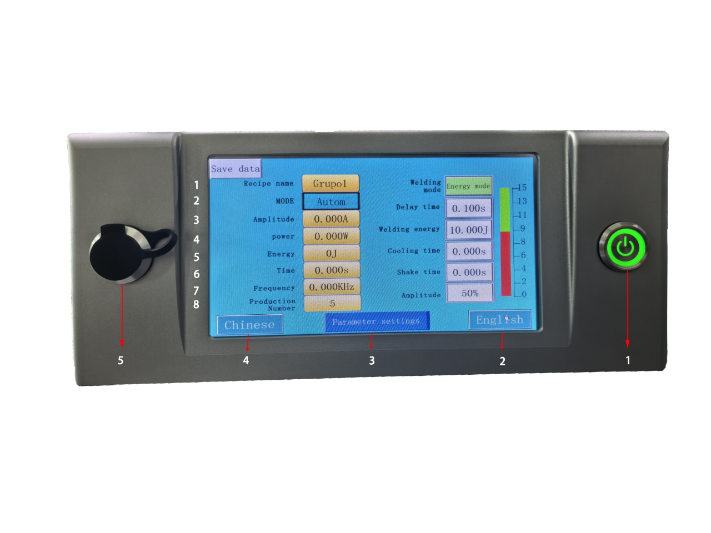
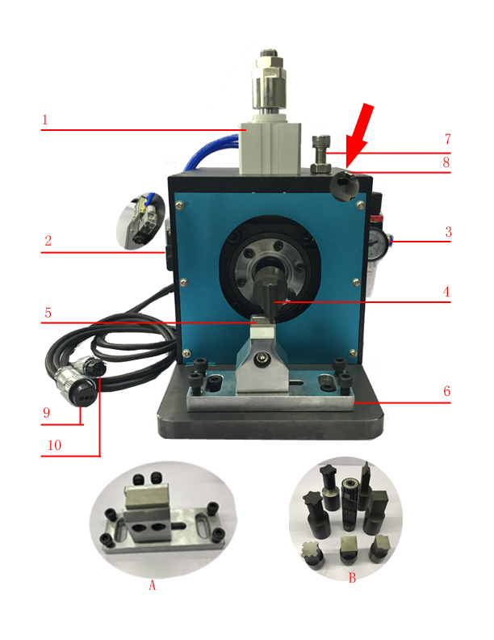
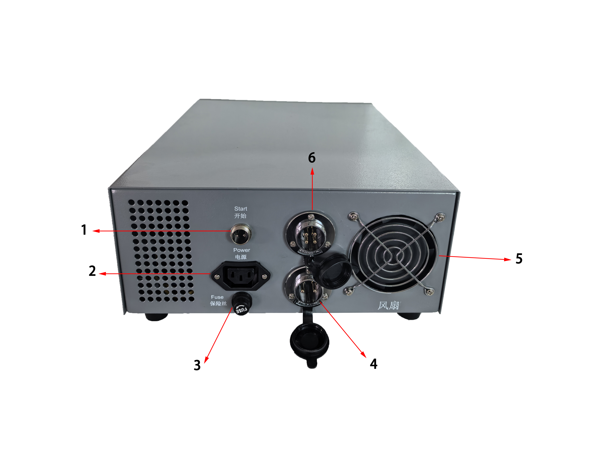

# SP-DH1000 Ultrasonic spot welder

> **SINOPRO** · 문서 번호 SINOPRO-M-SP-DH1000 · Rev. 1.0 · 2026. 08.

.png>)


본 설명서에 기재된 장비는 엄격한 품질 및 제조 기준에 따라 제작되었습니다.

출고 전 충분한 테스트와 검수를 완료하였으며, 본 설명서에 명시된 절차에 따라 올바르게 사용할 경우 장기간 안전하고 안정적인 성능을 유지할 수 있습니다.

장비를 사용하기 전에 「2. 안전 및 주의사항」의 내용을 반드시 확인하십시오.


## 1. 장치 정보

### 1-1. 장치 개요

SP-DH1000 Ultrasonic spot welder는 초음파 진동과 가압을 이용하여 금속 소재를 접합하는 초음파 용접 장비입니다. 이차전지 셀 제작 공정에서 전극 집전체와 탭(Tab)의 용접에 사용할 수 있으며, 권취형(Jelly Roll) 및 적층형(Stacking) 셀의 양극·음극 용접에 적용할 수 있습니다.

**초음파란?**

초음파는 인간의 가청 범위를 초과하는 주파수의 기계적 진동입니다. 일반적으로 18 kHz(18,000 Hz) 이상의 주파수를 초음파라고 하며, 사람의 귀에는 들리지 않습니다.

**초음파 용접의 원리**

초음파 용접은 고주파 전기 에너지를 기계적 진동으로 변환하여 금속 소재를 접합하는 방식입니다. 변환된 초음파 진동이 가압된 금속 소재의 접합면에 전달되면서 마찰이 발생하고, 이를 통해 금속 소재 간의 접합이 이루어집니다.

**초음파 시스템 구성**

초음파 용접 시스템은 다음의 주요 부품으로 구성됩니다:

* 구동 제어함 (Drive control box)\
  -초음파 용접에 필요한 고주파 전기 신호를 생성하고 장비의 용접 조건 및 동작을 제어합니다
* 부스터 (Booster)\
  -구동 제어함에서 전달된 전기 에너지를 기계적인 초음파 진동으로 변환합니다.
* 진동자 (Transducer)\
  진동자에서 발생한 초음파 진동의 진폭을 조정하고 혼(Horn)으로 전달합니다.
* 혼 (Horn)\
  -전달된 초음파 진동을 실제 용접 대상물에 전달하며, 가압 상태에서 금속 소재의 접합이 이루어지도록 합니다.
* 공압 작동 장치 및 고정 지그\
  -혼을 상·하로 구동하여 용접 대상물을 가압하고, 하부 금형 및 용접 대상물을 지정된 위치에 고정합니다.

### 1-2. 장치 구성

1. 초음파 발생기 및 제어부\
   터치 디스플레이, 전원 스위치, USB 포트 및 각종 설정·조작 기능을 통해 초음파 출력과 용접 조건을 설정하고 장비의 동작 상태를 확인합니다.
2. 용접 헤드부\
   에어 실린더, 솔레노이드 밸브, 에어 레귤레이터, 진동자(Transducer), 부스터(Booster), 혼(Horn) 및 스트로크 조절부로 구성됩니다. 압축공기를 이용하여 혼을 상·하로 구동하고, 초음파 진동을 용접 대상물에 전달합니다.
3. 하부 금형 및 고정 지그\
   용접 대상물을 받쳐주고 지정된 위치에 안정적으로 고정하는 부분입니다. 대상물의 형상 및 크기에 따라 받침대 또는 고정부의 형상을 변경하여 사용할 수 있습니다.
4. 본체 후면 및 연결부\
   전원 케이블, 풋 스위치, 진동자, 솔레노이드 밸브 및 냉각 팬 등의 연결 포트와 퓨즈로 구성됩니다.
5. 기본 제공 부속품\
   장비 사용 및 유지보수에 필요한 퓨즈, 육각 렌치, 풋 스위치 등의 기본 부속품이 제공됩니다.

본체 정면 및 제어 화면 구성

<table><thead><tr><th width="77" align="center">번호</th><th width="208">명칭</th><th>설명</th></tr></thead><tbody><tr><td align="center">1</td><td>본체 전원 스위치</td><td>본체의 전원을 ON/OFF하는 스위치입니다.</td></tr><tr><td align="center">2</td><td>영문 전환 버튼</td><td>터치하면 사용자 인터페이스가 영문 화면으로 전환됩니다.</td></tr><tr><td align="center">3</td><td>파라미터 설정 버튼</td><td>장비 전원을 켠 후 용접 조건값을 변경하려면 파라미터 설정 버튼을 터치하여 비밀번호를 입력해야 합니다. 비밀번호가 확인되면 용접 시간 등 용접 조건값을 변경할 수 있습니다. ※ 초기 비밀번호: <strong>8888</strong></td></tr><tr><td align="center">4</td><td>중문 전환 버튼</td><td>터치하면 사용자 인터페이스가 중국어 화면으로 전환됩니다.</td></tr><tr><td align="center">5</td><td>USB 출력 포트</td><td>USB 저장장치를 연결하여 용접 작업 데이터를 저장 및 추출할 수 있습니다.</td></tr></tbody></table>

**디스플레이 항목 설명**

<table><thead><tr><th width="79.25" align="center">번호</th><th>화면 표시</th><th>항목명</th><th align="center">설정 가능 여부</th><th width="274.25">기능 및 사용 방법</th><th width="186.0841064453125">검수 시 참고값</th></tr></thead><tbody><tr><td align="center"><strong>1</strong></td><td>MODE</td><td>운전 모드</td><td align="center">×</td><td><strong>Automatic(자동) / Mould(금형 조정)</strong> 모드를 선택합니다. 일반 용접 작업 시 Automatic 모드를 사용하며, 금형 교체 및 조정 시 Mould 모드를 사용합니다.</td><td>Automatic</td></tr><tr><td align="center"><strong>2</strong></td><td>Amplitude</td><td>전류/출력 표시</td><td align="center">×</td><td>초음파 동작 시 출력되는 전류값을 실시간으로 표시합니다. 표시 전용 항목으로 사용자가 직접 설정할 수 없습니다.</td><td>-</td></tr><tr><td align="center"><strong>3</strong></td><td>Power</td><td>실제 출력</td><td align="center">×</td><td>용접 시 실제 초음파 출력값을 표시합니다. 단위는 W이며, 표시 전용 항목으로 사용자가 직접 설정할 수 없습니다.</td><td>-</td></tr><tr><td align="center"><strong>4</strong></td><td>Energy</td><td>실제 에너지</td><td align="center">×</td><td>1회 용접 시 실제 사용된 에너지값을 표시합니다. 단위는 J이며, 표시 전용 항목으로 사용자가 직접 설정할 수 없습니다.</td><td>-</td></tr><tr><td align="center"><strong>5</strong></td><td>Time</td><td>실제 용접 시간</td><td align="center">×</td><td>1회 용접 시 실제 초음파 출력 시간을 표시합니다. 단위는 s이며, 표시 전용 항목으로 사용자가 직접 설정할 수 없습니다.</td><td>-</td></tr><tr><td align="center"><strong>6</strong></td><td>Frequency</td><td>실제 주파수</td><td align="center">×</td><td>장비 작동 시 자동으로 추적된 실제 초음파 주파수를 표시합니다. 단위는 kHz이며, 표시 전용 항목으로 사용자가 직접 설정할 수 없습니다.</td><td>-</td></tr><tr><td align="center"><strong>7</strong></td><td>Production Number</td><td>생산 수량</td><td align="center">×</td><td>용접 작업이 1회 완료될 때마다 수량이 자동으로 1씩 증가합니다. 현재 누적된 용접 작업 횟수를 확인할 수 있습니다.</td><td>-</td></tr><tr><td align="center"><strong>8</strong></td><td>Freq Scanning</td><td>주파수 스캔</td><td align="center">버튼</td><td>버튼을 터치하면 장비가 초음파 주파수를 자동으로 스캔하여 진동자(Transducer), 부스터(Booster), 혼(Horn)으로 구성된 진동계의 주파수를 매칭합니다. 혼 교체 후 또는 주파수 재조정이 필요한 경우 사용합니다.</td><td>검수 시 실행</td></tr><tr><td align="center"><strong>9</strong></td><td>Mould</td><td>금형 조정</td><td align="center">버튼</td><td>버튼을 터치하면 Mould(조정) 모드로 전환됩니다. Mould 모드에서는 풋 스위치를 눌러도 용접 동작이 실행되지 않으며, 혼(Horn) 및 받침대의 교체·위치 조정 등 셋업 작업 시 사용합니다.</td><td>-</td></tr><tr><td align="center"><strong>10</strong></td><td>Automatic</td><td>자동 운전 버튼</td><td align="center">버튼</td><td>버튼을 터치하면 Automatic(자동 운전) 모드로 전환됩니다. 자동 운전 모드에서는 풋 스위치를 누르면 설정된 용접 조건에 따라 용접 동작이 시작됩니다.</td><td>-</td></tr><tr><td align="center"><strong>11</strong></td><td>Sonic Test</td><td>초음파 테스트</td><td align="center">버튼</td><td>버튼을 터치하면 실제 용접 동작 없이 초음파 출력 상태를 점검할 수 있습니다. 테스트 시 전류값과 주파수 표시값을 확인하여 진동자(Transducer), 부스터(Booster), 혼(Horn)의 초음파 동작 상태를 확인합니다.</td><td>-</td></tr><tr><td align="center"><strong>12</strong></td><td>Clear</td><td>생산 수량 초기화 버</td><td align="center">버튼</td><td>Production Number의 생산 수량을 초기화합니다.</td><td>-</td></tr><tr><td align="center"><strong>13</strong></td><td>Reset</td><td>리셋 버튼</td><td align="center">버튼</td><td>장비에 과부하 또는 알람이 발생한 경우 버튼을 터치하여 알람 상태를 해제하고 장비를 리셋합니다.</td><td>-</td></tr><tr><td align="center"><strong>14</strong></td><td>Amplitude</td><td>진폭 설정</td><td align="center">●</td><td>초음파 출력의 진폭을 설정합니다. 용접 소재 및 용접 상태에 따라 조정하며, 조건 변경 시 낮은 값부터 단계적으로 조정합니다.</td><td><strong>30%</strong></td></tr><tr><td align="center"><strong>15</strong></td><td>Shake time</td><td>진동 해제 시간</td><td align="center">●</td><td>용접 완료 후 혼(Horn)이 상승한 상태에서 설정된 시간 동안 초음파 진동을 유지합니다. 이 진동을 통해 용접 대상물이 혼에 달라붙는 현상을 줄이고 분리를 돕습니다.</td><td><strong>0.0 s</strong></td></tr><tr><td align="center"><strong>16</strong></td><td>Cooling time</td><td>가압 유지 시간</td><td align="center">●</td><td>용접을 위한 초음파 출력이 완료된 후 혼(Horn)이 용접 대상물을 누른 상태로 유지되는 시간을 설정합니다. 설정 시간이 지나면 혼이 상승합니다.</td><td><strong>0.0 s</strong></td></tr><tr><td align="center"><strong>17</strong></td><td>Welding energy / Welding time</td><td>용접 에너지 / 용접 시간</td><td align="center">●</td><td>Welding mode 설정에 따라 표시 항목이 변경됩니다. Energy mode에서는 목표 용접 에너지(J)를 설정하고, Time mode에서는 초음파 출력 시간(s)을 설정합니다. 실제 용접 소재와 상태에 따라 조건을 조정합니다</td><td><strong>0.080 s</strong></td></tr><tr><td align="center"><strong>18</strong></td><td>Delay time</td><td>지연 시간</td><td align="center">●</td><td>혼(Horn)이 하강하여 용접 대상물을 가압한 후, 초음파 출력이 시작되기까지의 대기 시간을 설정합니다.</td><td><strong>0.080 s</strong></td></tr><tr><td align="center"><strong>19</strong></td><td>Welding mode</td><td>용접 모드</td><td align="center">●</td><td>Energy mode(에너지 모드) 또는 Time mode(시간 모드)를 선택합니다. 선택한 모드에 따라 17번 설정 항목이 <code>Welding energy</code> 또는 <code>Welding time</code>으로 변경됩니다.</td><td>Time mode</td></tr></tbody></table>

**용접 헤드**

<table><thead><tr><th width="81.5" align="center">번호</th><th width="286.75">구성품명</th><th>기능 및 설명</th></tr></thead><tbody><tr><td align="center">1</td><td><strong>에어 실린더</strong> </td><td>압축공기 공급 시 혼(Horn)을 상·하로 구동하는 공압 실린더입니다. 용접 작업 및 위치 조정 시 혼의 하강 동작을 수행하며, 하강 스트로크를 조정할 수 있습니다.</td></tr><tr><td align="center">2</td><td><strong>솔레노이드 밸브</strong> </td><td>에어 실린더로 공급되는 압축공기의 흐름을 전환하여 실린더의 상승·하강 동작을 제어합니다. 이를 통해 혼(Horn)의 상승 및 하강 동작을 제어합니다.</td></tr><tr><td align="center">3</td><td><strong>에어 레귤레이터</strong></td><td>압축공기 공급 라인에 설치되어 에어 실린더로 공급되는 공압을 조절합니다. 설정 압력에 따라 혼(Horn)이 용접 대상물을 가압하는 힘에 영향을 주므로, 용접 조건에 맞게 적정 압력으로 조절하여 사용합니다. 또한 필터를 통해 압축공기에 포함된 수분을 분리합니다.</td></tr><tr><td align="center">4</td><td><strong>용접 혼</strong> </td><td>용접 대상물에 초음파 진동을 전달하여 실제 용접이 이루어지는 부분입니다. 사용 주파수에 따라 <strong>20 kHz / 25 kHz / 35 kHz / 40 kHz</strong> 등으로 구분되며, 용접 조건 및 대상물에 따라 다양한 형상의 혼을 사용할 수 있습니다. <strong>(그림 B 참조)</strong></td></tr><tr><td align="center">5</td><td><strong>하부 금형 블록</strong> </td><td>용접 대상물을 받쳐주는 하부 금형 구성품으로, 용접 대상물의 형상 및 사양에 따라 다양한 형태로 적용할 수 있습니다. <strong>(그림 A 참조)</strong></td></tr><tr><td align="center">6</td><td><strong>하부 금형 고정 지그</strong></td><td>하부 금형을 지정된 위치에 고정하여 용접 중 위치가 움직이지 않도록 지지하는 부품입니다. 작업 조건 및 하부 금형의 형상에 따라 적합한 고정 지그를 적용할 수 있습니다. <strong>(그림 A 참조)</strong></td></tr><tr><td align="center">7</td><td><strong>상승 스트로크 조절 나사</strong> </td><td>혼(Horn)의 상승 위치와 상승 스트로크를 조정하는 나사입니다. 작업물 높이 및 용접 조건에 맞게 조정하여 사용합니다.</td></tr><tr><td align="center">8</td><td><strong>진동자 고정 나사</strong> </td><td>진동자 및 혼(Horn) 조립부를 고정하는 나사입니다. 나사를 풀어 혼의 용접면 방향을 조정하거나 혼을 교체할 수 있습니다.</td></tr><tr><td align="center">9</td><td><strong>진동자 연결 커넥터</strong> </td><td>제어 본체와 진동자(Transducer)를 연결하여 초음파 신호를 전달하는 커넥터입니다.</td></tr><tr><td align="center">10</td><td><strong>솔레노이드 밸브·팬 연결 커넥터</strong></td><td>제어 본체와 연결하여 솔레노이드 밸브의 구동 신호 및 냉각 팬의 전원을 공급하는 커넥터입니다. ※ 냉각 팬 사용 전원: AC 220 V</td></tr><tr><td align="center">A</td><td>하부 금형 및 고정 지그</td><td>용접 대상물의 형상 및 사양에 따라 다양한 형태의 하부 금형과 고정 지그를 적용할 수 있습니다.</td></tr><tr><td align="center">B</td><td>혼(Horn)</td><td>용접 소재, 형상 및 용접 조건에 따라 다양한 형상의 혼(Horn)을 적용할 수 있습니다.</td></tr></tbody></table>


⚠ 팬은 **220V** 사용 주의합니다.


**본체 뒤면**

<table><thead><tr><th width="70" align="center">번호</th><th width="281">명칭</th><th>설명</th></tr></thead><tbody><tr><td align="center">1</td><td>풋 스위치 포트</td><td>풋 스위치를 연결하는 포트입니다. Automatic(자동 운전) 모드에서 풋 스위치 입력을 통해 용접 동작을 시작합니다. 외부 자동화 장치의 트리거 신호 입력용으로도 사용할 수 있습니다.</td></tr><tr><td align="center">2</td><td>전원 케이블 포트</td><td>장비의 전원 케이블을 연결하는 포트입니다. 입력 전원은 AC 220 V를 사용합니다.</td></tr><tr><td align="center">3</td><td>퓨즈 (15A)</td><td>과전류 또는 과부하 발생 시 회로를 차단하여 장비의 전기 회로를 보호합니다.</td></tr><tr><td align="center">4</td><td>진동자(Transducer) 연결 포트</td><td>제어 본체와 진동자(Transducer)를 연결하는 9핀 커넥터 포트입니다.</td></tr><tr><td align="center">5</td><td>냉각 팬</td><td>장비 내부에서 발생하는 열을 외부로 배출하여 내부 온도 상승을 줄이는 냉각용 팬입니다.</td></tr><tr><td align="center">6</td><td>솔레노이드 밸브·팬 연결 포트</td><td>용접 헤드부의 솔레노이드 밸브 및 냉각 팬 연결 커넥터를 연결하는 10핀 포트입니다. 솔레노이드 밸브 구동 및 냉각 팬 전원 공급에 사용됩니다.</td></tr></tbody></table>


⚠️ **주의**: 이 포트에는 **220V 전원**이 공급되므로, 설치 또는 점검 시 반드시 **전원을 차단한 상태**에서 작업해야 합니다.


**기본 제공 부속품**

| 품목    |   수량  |
| ----- | :---: |
| 퓨즈    |   1   |
| 육각 렌치 | 1 SET |
| 풋 스위치 |   1   |

### 1-3. 장치 사양 및 규격&#x20;

<table><thead><tr><th width="242">항목</th><th>본문 참고 수치</th></tr></thead><tbody><tr><td>출력</td><td>800W</td></tr><tr><td>초음파 주파수</td><td>40 kHz ±0.15 kHz</td></tr><tr><td>입력 전압</td><td>AC 220V/ 50Hz/ 60Hz</td></tr><tr><td>용접 시간 정밀도</td><td>0.001 s</td></tr><tr><td>출력 조절 방식</td><td>무단 연속 조절 + 지능형 정출력 제어</td></tr><tr><td>에너지 변환 효율</td><td>≥92%</td></tr><tr><td>역률</td><td>≥0.95</td></tr><tr><td>장비 운전 소음</td><td>＜75 dB</td></tr><tr><td>압력 조절 범위</td><td>0~1 Mpa 조절 가능</td></tr><tr><td>시간 조절 범위</td><td>0~60s 조절 가능</td></tr><tr><td>1회 용접 시간</td><td>≤0.5 s</td></tr><tr><td>진폭 조절 범위</td><td>10~100%</td></tr><tr><td>품질 관리 기능</td><td>주파수, 출력, 에너지, 진폭 상한·하한 초과 시 경보 및 장비 정지</td></tr></tbody></table>

#### 고객 용접 공정 요구사항 및 제품 적용 사양

본 장비는 신에너지 배터리 셀 용접 공정에 맞춰 설계되었으며, 권취형(Jelly Roll) 및 적층형(Stacking) 셀의 양극·음극 용접에 적용 가능합니다. 구체적인 공정 요구사항 및 제품 적용 사양은 다음과 같습니다.

<table><thead><tr><th width="180">항목</th><th>세부 요구사항</th><th>사양</th></tr></thead><tbody><tr><td><strong>소재 적용</strong></td><td>핵심 사양</td><td>40 kHz (800 W)</td></tr><tr><td><strong>음극 용접</strong></td><td>소재 재질 / 두께</td><td>Copper Foil / 4~8 μm</td></tr><tr><td></td><td>탭(Tab) 재질 / 두께</td><td>Nickel Tap / 0.06~0.1 mm</td></tr><tr><td><strong>양극 용접</strong></td><td>소재 재질 / 두께</td><td>Al Foil / 6~25 μm</td></tr><tr><td></td><td>탭(Tab) 재질 / 두께</td><td>알루미늄(Al) / 0.06~0.1 mm</td></tr><tr><td><strong>배터리 셀 적용</strong></td><td>셀 구조 / 적층 수</td><td>권취형(Jelly Roll) 또는 적층형(Stacking) / 1~20층</td></tr><tr><td></td><td>용접 자국 크기</td><td>4 mm × 4 mm (맞춤 제작 가능)</td></tr><tr><td><strong>용접 혼</strong>(Horn) <strong>/ 앤빌</strong>(Anvil)</td><td>용접 혼 재질 / 수명</td><td>수입산 고속도강(HSS) / 음극 30만 회 이상, 양극 50만 회 이상</td></tr><tr><td></td><td>앤빌 재질 / 수명</td><td>고속도강(HSS) / 음극 30만 회 이상, 양극 50만 회 이상</td></tr></tbody></table>

## 2. 안전 및 주의사항

### 2-1. 경고 표지 및 기호 설명


**위험 (DANGER)** — 지시사항을 준수하지 않을 경우 사망 또는 중상으로 이어질 수 있는 즉각적인 위험 상황을 의미합니다.



**경고 (WARNING)** — 지시사항을 준수하지 않을 경우 사망 또는 중상으로 이어질 수 있는 잠재적인 위험 상황을 의미합니다.



**주의 (CAUTION)** — 지시사항을 준수하지 않을 경우 경상 또는 장비 손상이 발생할 수 있는 위험 상황을 의미합니다.


### 2-2. 작업자 안전 수칙

**안전 주의사항 (Safety Precautions)**

장비 설치 및 사용 전 본 사용설명서를 충분히 숙지해 주시기 바랍니다.\
본 장비는 작업자의 안전을 고려하여 설계되었으나, 부주의하거나 올바르지 않은 사용으로 인해 안전사고 또는 장비 손상이 발생할 수 있습니다.\
안전한 장비 사용과 장비 보호를 위해 사용 전 아래의 안전 주의사항 및 사용방법을 반드시 확인해 주시기 바랍니다.


장비 및 전기 제어함 내부에는 고전압이 인가되는 부분이 있으니커버 분리 또는 유지보수 작업 전에는 반드시 전원을 차단해야 합니다.


* 장비 내부에는 고전압이 흐르는 부분이 있습니다. 커버를 분리하거나 유지보수 작업을 진행하기 전에는 반드시 전원을 차단해야 합니다.
* 장비는 3핀 전원 플러그를 사용하며 올바르게 접지된 상태에서 사용해야 합니다.
* 장비는 반드시 정상적으로 접지된 전원 콘센트에 연결해야 합니다.
* 전기 제어함 내부에는 고전압이 인가되는 부분이 있으므로 작업 시 각별한 주의가 필요합니다.
* 초음파 트랜스듀서(진동자)의 전기 접점은 직접 접촉해서는 안 됩니다.
* 초음파 출력 중에는 용접 혼(Horn) 또는 부스터(Booster)를 손으로 잡거나 접촉해서는 안 됩니다.
* 승인 없이 용접 혼의 구성이나 구조를 임의로 변경해서는 안 됩니다.
* 40 kHz 초음파 용접 작업 시 정상 작동 상태에서도 초음파 작동음이 발생할 수 있습니다.
* 용접 혼에는 별도의 장치나 부속품을 임의로 설치해서는 안 됩니다.

**전기 관련 주의**


솔레노이드 밸브 및 팬 연결 포트에는 AC 220V 전원이 공급됩니다. 설치 또는 점검 작업 전에는 반드시 전원을 차단해야 합니다.\
_(1-2. 본체 후면 참조)_



냉각 팬은 AC 220V 전원을 사용하므로 설치 및 점검 시 주의가 필요합니다.\
_(1-2. 용접 헤드 참조)_


### 2-3. 설치 환경 주의사항

* 장비는 진동이 적고 단단하며 수평이 유지되는 작업대 위에 설치하십시오.
* 장치 셋팅 시 및 유지보수를 위해 장치 주변 최소 50cm 이상의 여유 공간이 필요합니다.

## 3. 설치 및 운반

### 3-1. 용접 헤드 설치 및 장치 이동

**용접 헤드 설치 시 주의사항**

1. 진동자와 용접 혼(Horn)의 접촉면은 깨끗하고 평탄한 상태를 유지해야 하며, 균열이나 손상이 없어야 합니다.
2. 부스터(Booster)와 용접 혼은 휘어짐이나 변형이 없는 상태여야 합니다.
3. 용접 혼 조립부를 설치하거나 분리할 때는 반드시 지정된 전용 공구를 사용해야 합니다.
4. 모든 나사 체결부가 단단히 고정되어 있고, 각 접촉면의 접촉 상태가 양호한지 확인해야 합니다.
5. 전원을 켠 후 무부하 상태에서 Sonic Test(초음파 테스트) 버튼을 눌러 작동 상태를 확인합니다. 테스트 시 약한 고주파음이 발생하며, 부스터에서 미세한 진동이 느껴질 수 있습니다.
6. 장치 이동 전 전원을 차단하고, 제어 본체와 용접 헤드부를 연결하는 케이블을 분리한 후 이동하는 것을 권장합니다. 이동 시 혼(Horn) 및 용접 헤드부에 충격이 가해지지 않도록 주의하십시오.

**용접 헤드 정렬**

혼(Horn)과 하부 금형을 장착한 후, 실린더를 수동으로 작동하여 혼이 하부 금형에 가까워질 때까지 천천히 하강시킵니다.\
혼과 하부 금형의 접촉 위치 및 평행 상태를 확인한 후 하부 금형 고정 지그를 단단히 고정합니다. 용접 위치에서 혼과 하부 금형이 정확하게 정렬되어 있는지 확인하십시오.

### 3-2. 유틸리티 연결

<table><thead><tr><th width="161">유틸리티</th><th>내용 (본문 기준)</th></tr></thead><tbody><tr><td>전원</td><td>AC 220 V / 50 Hz — 본체 후면의 전원 케이블 포트에 연결</td></tr><tr><td>압축 공기</td><td>M8 에어 호스 권장, 에어 레귤레이터를 통해 2~3 kg/cm²로 조절</td></tr><tr><td>풋 스위치</td><td>본체 후면의 풋 스위치 포트에 연결 — Automatic(자동 운전) 모드에서 용접 동작 시작에 사용</td></tr></tbody></table>


상세 연결 순서는 **4-2. 장비 조작**의 작동 절차(1\~3단계)를 참조하세요.


## 4. 사용 및 조작 방법

### 4-1. 사용 전 준비사항

**용접 헤드 설치 시 주의사항**

1. 전원 케이블, 진동자 연결 케이블 및 솔레노이드 밸브·팬 연결 케이블의 연결 상태를 확인합니다.
2. 압축공기가 정상적으로 공급되고 있는지 확인하고, 에어 레귤레이터의 압력이 작업 조건에 맞게 설정되어 있는지 확인합니다.
3. 혼(Horn)과 하부 금형의 장착 및 위치 상태를 확인합니다.
4. 혼과 하부 금형 사이에 이물질이나 작업에 방해되는 물체가 없는지 확인합니다.
5. 풋 스위치가 본체 후면 포트에 정상적으로 연결되어 있는지 확인합니다
6. 작업 전 용접 모드, 진폭, 용접 시간 또는 에너지 등 설정된 용접 조건을 확인합니다.


**경고:** 초음파 테스트 중에는 부스터를 손으로 잡거나 강하게 접촉해서는 안 됩니다. 초음파 진동으로 인해 피부 화상이 발생할 수 있습니다.


### 4-2. 장비 조작

**작동 절차**



### 초음파 및 풋스위치 연결

제어 본체와 용접 헤드부의 진동자(Transducer) 연결 케이블 및 솔레노이드 밸브·팬 연결 케이블을 각각 해당 포트에 연결합니다. 풋 스위치는 본체 후면의 풋 스위치 포트에 연결합니다.



### 전원 연결

전원 케이블을 본체 후면의 전원 케이블 포트에 연결합니다


⚠ 본 장비는 별도 표기가 없는 경우 AC 220 V / 50 Hz 전원을 사용합니다.




### 압축공기 연결

도면 2의 ③번 에어 레귤레이터(Air Regulator)에 에어 호스를 연결하여 압축공기를 공급합니다.

※ 에어 호스는 M8 규격 사용을 권장합니다.



### 전원 스위치 ON

본체 전원 스위치를 ON으로 전환하여 장비의 전원을 켭니다.



### 초음파 동작 확인 ( 필요시 )&#x20;

도면 1의 ⑤번 Freq Scanning(주파수 스캔) 버튼을 눌러 발진기, 진동자(Transducer) 및 혼(Horn)의 주파수를 자동으로 매칭합니다.

이후 도면 1의 ⑮번 Sonic Test(초음파 테스트) 버튼을 눌러 초음파 출력 및 주파수 매칭 상태가 정상인지 확인합니다.


주파수가 정상적으로 매칭된 경우 전류는 약 0.3 A, 주파수는 약 40 kHz로 표시됩니다.




### 공압 조절

공압은 **0.4 \~ 0.5Mpa** 로 조절합니다. 에어 레귤레이터를 사용하여 공급 공압을 조정합니다.



### 혼 높이 및 스트로크 조정

용접 대상물의 높이와 용접 위치에 맞게 혼(Horn)의 높이 및 스트로크를 조정합니다. 상승 위치는 상승 스트로크 조절 나사를 이용하여 조정합니다.



### 진폭 및 출력 조정

조작 화면의 Amplitude(진폭)를 설정하여 용접 대상물에 맞게 초음파 출력 세기를 조정합니다.

※ 장비 검수 및 테스트 용접 시 Amplitude 50%를 참고값으로 사용합니다. 실제 설정값은 용접 소재 및 용접 상태에 따라 조정합니다.



### 시간 조절

조작 화면의 15\~19번 항목을 사용하여 진동 유지 시간, 가압 유지 시간, 용접 에너지 또는 용접 시간, 용접 시작 지연 시간 및 용접 모드를 설정합니다.


⚠ 용접 품질은 진폭, 용접 에너지 또는 용접 시간 등 설정 조건에 따라 달라질 수 있으므로 실제 용접 상태를 확인하면서 단계적으로 조정합니다.




### 용접 시작

용접 대상물을 하부 금형의 용접 위치에 올바르게 배치한 후 **Automatic(자동 운전) 모드**로 전환합니다.\
풋 스위치를 **한 번 눌렀다 떼면** 용접 동작이 시작되며, 설정된 용접 조건에 따라 1회 용접 사이클이 자동으로 진행됩니다.\
혼(Horn)이 하강하여 용접 대상물을 가압한 후 초음파 용접을 수행하며, 용접 완료 후 혼은 상승 위치로 복귀합니다.



### 4-3. 사용 후 정리

1. **용접 작업 종료**\
   마지막 용접 사이클이 완료되고 혼(Horn)이 상승 위치로 복귀한 것을 확인합니다.
2. **혼 및 하부 금형 확인**\
   혼과 하부 금형에 용접 잔여물이나 이물질이 남아 있는지 확인하고, 필요한 경우 깨끗하게 제거합니다.
3. **장비 전원 OFF**\
   작업이 완료되면 본체 전원 스위치를 OFF로 전환합니다.
4. **압축공기 차단**\
   에어 컴프레서(Air Compressor)의 압축공기 공급을 차단합니다.
5. **작업 공간 정리**\
   용접 시료 및 주변 작업 공간을 정리하고 장비에 이상이 없는지 확인합니다.

## 5. 유지보수 및 트러블슈팅

### 5-1. 정기 점검 항목

| 점검 항목        | 점검 내용                                         | 권장 주기 |
| ------------ | --------------------------------------------- | ----- |
| 혼(Horn)      | 용접면의 마모, 손상, 이물질 부착 여부 확인                     | 사용 전  |
| 하부 금형        | 접촉면의 마모, 손상 및 이물질 확인                          | 사용 전  |
| 혼 및 하부 금형 정렬 | 혼과 하부 금형의 위치 및 평행 상태 확인                       | 사용 전  |
| 체결부          | 혼, 진동자 및 주요 고정 나사의 풀림 여부 확인                   | 주 1회  |
| 공압 계통        | 에어 호스 및 연결부의 누설 여부, 공급 압력 **0.4\~0.5 MPa** 확인 | 사용 전  |
| 에어 레귤레이터     | 필터 내부 수분 및 오염 상태 확인                           | 주 1회  |
| 케이블·커넥터      | 손상, 풀림 및 접촉 불량 여부 확인                          | 주 1회  |
| 냉각 팬         | 팬 작동 및 흡·배기부 막힘 여부 확인                         | 주 1회  |

### 5-2. 주요 소모품 및 부품 교체

| 부품 명칭    | 비고 (본문 기준)                                                                                                |
| -------- | --------------------------------------------------------------------------------------------------------- |
| 퓨즈 (15A) | 과전류 또는 과부하 발생 시 회로를 차단하여 장비를 보호합니다. 퓨즈가 단선된 경우 동일한 정격의 퓨즈로 교체합니다.                                         |
| 혼(Horn)  | 용접면이 마모 또는 손상되어 정상적인 용접이 어려운 경우 교체합니다. 혼 교체 후에는 **Freq Scanning(주파수 스캔)**&#xC744; 실시하여 장비와 혼의 주파수를 매칭합니다. |
| 하부 금형    | 용접면이 마모 또는 손상되어 용접 위치 및 품질에 영향을 주는 경우 교체합니다.                                                              |

### 5-3. 트러블슈팅

**과부하 보호**

장비에 과부하가 발생하면 발진기에서 경고음이 발생하며, 과부하 보호 회로가 작동하여 초음파 출력을 중단합니다.

설정이 적절하지 않거나 용접부 조립 상태가 느슨한 상태에서 장비를 작동할 경우 과부하가 발생할 수 있으며, 과부하 보호 기능은 전원부 및 주요 구성품을 보호하기 위해 작동합니다.

과부하 상태가 발생하면 과부하 표시등이 계속 점등됩니다. 과부하가 반복적으로 발생하는 경우 장비 고장을 방지하기 위해 원인을 확인하고 문제를 해결해야 합니다.

**과부하 발생 시 점검 사항**

* 진동자(Transducer)의 이상 여부를 확인합니다.
* 부스터(Booster)의 이상 여부를 확인합니다.
* 혼(Horn)의 하강 속도를 확인합니다.
* 연결 스터드의 체결 상태를 확인합니다.
* 진동자와 혼의 접촉면 상태를 확인합니다.
* 진동자, 혼 및 부스터에 균열이 있는지 확인합니다.
* 용접 중 표시되는 에너지 비율이 100%를 초과하는지 확인합니다. 100%를 초과하는 경우 더 높은 출력의 발진기가 필요할 수 있습니다.
* 위 항목을 확인한 후에도 원인을 찾을 수 없는 경우 A/S에 문의해야 합니다.

**고장 및 유지보수**

<table><thead><tr><th width="249">이상 현상</th><th>원인</th><th>조치 방법</th></tr></thead><tbody><tr><td>제어 본체의 전원을 켰으나 전원이 켜지지 않음</td><td>
1. 전원 스위치 접촉 불량  

2. 전원 퓨즈 단선
</td><td>
1.전원 케이블 연결 및 전원 스위치 상태 확인

2. 퓨즈 상태 확인 후 단선된 경우 동일 정격 퓨즈로 교체
</td></tr><tr><td>용접 상태 불량</td><td>
1.진폭(Amplitude) 설정이 적절하지 않음

2.용접 시간 또는 용접 에너지 설정이 적절하지 않음
</td><td>
1. 진폭 설정값을 확인하고 단계적으로 조정합니다.

2. 용접 모드에 따라 용접 시간 또는 용접 에너지 값을 조정한 후 용접 상태를 다시 확인합니다.
</td></tr><tr><td>전원 인가 시 퓨즈가 반복적으로 단선됨</td><td>
1. 파워 트랜지스터(출력 소자) 손상 가능

2. 브리지 정류기(다이오드 모듈) 손상 가능
</td><td>장비 사용을 중지하고 전원을 차단한 후 기술지원(A/S)에 문의하십시오</td></tr><tr><td>전원 ON 후 풋 스위치를 눌러도 용접 동작이 시작되지 않음</td><td>
1.풋 스위치 연결 불량 2.풋 스위치 이상

3.Automatic(자동 운전) 모드가 선택되지 않음
</td><td>
1. 풋 스위치가 본체 후면 포트에 정상적으로 연결되어 있는지 확인합니다. 2.연결 상태가 정상인데도 동작하지 않을 경우 풋 스위치의 이상 여부를 확인하고 필요 시 교체합니다.

3.Automatic 모드로 전환한 후 다시 작동합니다
</td></tr><tr><td>용접 품질이 일정하지 않음</td><td>

1.혼(Horn) 또는 하부 금형의 오염·마모

2.혼과 하부 금형의 정렬 상태 불량

3.공급 공압이 적절하지 않거나 불안정함

4.진폭, 용접 시간 또는 용접 에너지 설정이 적절하지 않음
</td><td>

1.혼과 하부 금형의 상태를 확인하고 이물질을 제거합니다.

2.혼과 하부 금형의 위치 및 평행 상태를 확인합니다.

3.에어 레귤레이터의 공급 압력이 <strong>0.4 ~ 0.5 MPa</strong>인지 확인합니다.

4.용접 조건을 확인하고 실제 용접 상태에 따라 단계적으로 조정합니다.
</td></tr></tbody></table>


기타 원인은 공급사에 문의하십시오. (→ **6. 기술지원**)


## 6. 기술지원 (A/S)

### 6-1. A/S 접수 절차 및 문의처



### 장비 정보 확인

장비 모델명(SP-DH1000)과 **시리얼 번호**를 확인합니다.



### 1차 확인

「5-3. 트러블슈팅」을 참고하여 증상 및 조치 방법을 우선 확인합니다.



### 기술지원문의

1차 점검 후에도 문제가 해결되지 않는 경우 아래 문의처로 연락하십시오. 문의 시 이상 현상이 발생한 위치와 증상을 설명하고, 가능하면 관련 사진 또는 영상을 함께 전달해 주십시오.



| 구분       | 내용                                                              |
| -------- | --------------------------------------------------------------- |
| 회사명      | 주식회사 시노프로                                                       |
| 주소       | 대전광역시 유성구 복용동로 43, F625\~626호, F642\~645호 (34202)               |
| 대표 전화    | 042-721-7277                                                    |
| 기술지원 연락처 | 070-7537-0075                                                   |
| 이메일      | [Tech-Support@sinopro.co.kr](mailto:Tech-Support@sinopro.co.kr) |
| 홈페이지     | [www.sinopro.co.kr](http://www.sinopro.co.kr/)                  |

### 6-2. 품질 보증 기간 및 조건

| 구분         | 기간        |
| ---------- | --------- |
| 본체         | 납품일로부터 1년 |
| 소모품 (퓨즈 등) | 보증 제외     |
