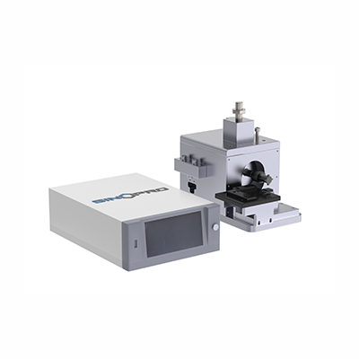

# SP-DH1000 Ultrasonic spot welder

> **SINOPRO** · 문서 번호 SINOPRO-M-SP-DH1000 · Rev. 1.0 · 2026. 08.


본 설명서에 포함된 시스템은 최고 품질의 자재로 제작되며 엄격한 제조 기준에 따라 생산되었습니다.&#x20;

출고 전 철저한 테스트와 검수를 완료하였으며, 본 설명서에 명시된 절차에 따라 사용하면 오랜 기간 동안 안전하고 안정적인 성능을 제공합니다.&#x20;

장비를 사용하기 전에 **2. 안전 및 주의사항**을 반드시 읽어 주세요.


## 1. 장치 정보

### 1-1. 장치 개요

**초음파란?**

초음파는 인간의 가청 범위 상한을 초과하는 주파수의 기계적 진동입니다. 일반적으로 **18kHz(18,000Hz)** 이상의 주파수를 초음파라고 하며, 사람의 귀에는 들리지 않습니다.

**초음파 용접의 원리**

초음파 용접의 기본 원리는 **전기 에너지를 기계적 진동으로 변환**하는 것입니다. 고주파 전기 에너지가 고주파 기계 진동으로 변환되고, 이 진동이 가압 상태의 금속 공작물 접합면에서 마찰열을 발생시킵니다. 이 열에 의해 모재를 녹이지 않고 고상 야금 접합이 이루어져, 용접이 완성됩니다.

**초음파 시스템 구성**

초음파 용접 시스템은 다음의 주요 부품으로 구성됩니다:

* 구동 제어함 (Drive control box)
* 증폭봉 (Booster)
* 트랜스듀서 (진동자, Transducer)
* 용접 헤드 (Welding horn)
* 공압 작동 장치 및 고정 지그

### 1-2. 장치 구성

**본체 정면 — 초음파 웰딩기 제어 화면 설명**

<table><thead><tr><th width="77" align="center">번호</th><th width="208">명칭</th><th>설명</th></tr></thead><tbody><tr><td align="center">1</td><td>발생기 본체 전원 스위치</td><td>이 버튼을 통해 본체의 전원을 켜고 끌 수 있습니다.</td></tr><tr><td align="center">2</td><td>영문 전환 버튼</td><td>이 버튼을 누르면 사용자 인터페이스를 영어 화면으로 전환할 수 있습니다.</td></tr><tr><td align="center">3</td><td>파라미터 설정 버튼</td><td>
이 버튼을 누르면 비밀번호를 입력하여 파라미터 설정 화면으로 진입할 수 있습니다. 

파라미터 설정 관련 내용은 그림 4를 참조해 주십시오. 

※ 초기 비밀번호는 8888입니다.
</td></tr><tr><td align="center">4</td><td>중문 전환 버튼</td><td>이 버튼을 누르면 사용자 인터페이스를 중국어 화면으로 전환할 수 있습니다.</td></tr><tr><td align="center">5</td><td>USB 출력 포트</td><td>USB 포트를 통해 각 용접 작업의 상세 데이터를 추출할 수 있습니다.</td></tr></tbody></table>

**디스플레이 항목 설명**

.jpeg>)

<table><thead><tr><th width="75" align="center">번호</th><th width="242">항목</th><th>설명</th></tr></thead><tbody><tr><td align="center">1</td><td>모드 (Mode)</td><td>장비의 현재 작동 상태를 표시합니다. (자동 모드, 금형 조정 모드 등 표시되며, 이 항목은 조정 불가입니다)</td></tr><tr><td align="center">2</td><td>전류 (Amplitude)</td><td>작업 시 발생하는 실제 전류 크기를 표시합니다. 기기의 출력 세기를 나타내며, 조정은 불가능합니다. ※ 무부하시 전류 수치를 통해 용접 헤드의 이상 유무도 판단할 수 있습니다.</td></tr><tr><td align="center">3</td><td>출력 (Power)</td><td>작업 중 장비의 실시간 출력값을 표시합니다. 매번 용접 시 출력 수치를 통해 용접 품질을 판단할 수 있습니다.</td></tr><tr><td align="center">4</td><td>에너지 (Energy)</td><td>각 용접 작업에서 소모된 에너지 크기를 표시합니다. 출력값과 함께 용접 품질 평가 기준으로 사용됩니다.</td></tr><tr><td align="center">5</td><td>시간 (Time)</td><td>에너지 모드에서 각 용접 작업에 소요된 시간을 표시합니다. 작업 시간 기준으로 공정 일관성 확인이 가능합니다.</td></tr><tr><td align="center">6</td><td>주파수 (Frequency)</td><td>장비가 작동할 때마다 시스템이 자동으로 주파수를 추적하여 작동 안정성을 유지합니다. ※ 해당 항목은 사용자가 수동으로 조정할 수 없습니다.</td></tr><tr><td align="center">7</td><td>생산량 (Production Number)</td><td>장비가 한 번 용접을 완료할 때마다 1씩 증가하며, 총 작업 수량을 표시합니다.</td></tr><tr><td align="center">8</td><td>Freq Scanning</td><td>발생기(웰딩기)와 용접 헤드는 주파수를 맞춰야 합니다. 용접 헤드를 교체한 후 'Freq Scanning' 버튼을 누르면 장치가 자동으로 주파수를 보정하여 정상 작동을 보장합니다. 주파수로 재설정해야 합니다.</td></tr><tr><td align="center">9</td><td>금형 조정 (Mould)</td><td>금형을 교체하거나 수평을 맞출 때 사용하는 모드로, 비작업 상태에서 오작동을 방지하기 위해 해당 버튼을 눌러 진입합니다.</td></tr><tr><td align="center">10</td><td>자동 (Automatic)</td><td>정상 용접 작업 시 사용하는 버튼으로, 이 버튼을 누르면 장비가 자동으로 용접을 시작합니다.</td></tr><tr><td align="center">11</td><td>음파 테스트 (Sonic Test)</td><td>장비 설치 완료 후 또는 용접 헤드 교체 후 이 버튼을 눌러 현재 장치의 작동 주파수, 음파 발생 여부 및 전류 상태를 점검할 수 있습니다.</td></tr><tr><td align="center">12</td><td>초기화 (Clear)</td><td>누적된 생산 수량 카운터를 초기화합니다. 버튼을 터치하면 생산량 수치가 0으로 변경.</td></tr><tr><td align="center">13</td><td>리셋 (Reset)</td><td>장비가 과부하 상태일 때 이 버튼을 눌러 과부하 알람을 해제합니다. 버튼을 가볍게 터치하여 경고 상태를 초기화할 수 있습니다.</td></tr><tr><td align="center">14</td><td>진폭 (Amplitude)</td><td>장비의 진동 크기를 조절하는 항목입니다. 실제 작업 조건에 맞추어 설정할 수 있으며, 숫자 입력창을 터치해 값을 입력합니다. 작은 값에서 점차 큰 값으로 조정하는 것을 권장합니다.</td></tr><tr><td align="center">15</td><td>진동 해제 시간 (Shake Time)</td><td>
발생기의 2차 발진 시간을 설정하여 용접 헤드가 공작물에 달라붙는 것을 방지합니다. 

실제 작업 조건에 맞추어 설정하며, 숫자 입력창을 터치해 값을 입력합니다. 작은 값부터 순차적으로 늘려 설정하는 것을 권장합니다.
</td></tr><tr><td align="center">16</td><td>냉각 시간 (Cooling Time)</td><td>초음파 발생이 완료된 후 용접 헤드가 공작물 위에 머무르는 시간을 조정합니다. 숫자 입력창을 터치해 값을 입력하며, 작은 값에서 점진적으로 늘려 설정하는 것을 권장합니다.</td></tr><tr><td align="center">17</td><td>용접 에너지 (WELDING ENERGY)</td><td>용접 과정에서 용접 헤드가 재료에 전달하는 총 에너지를 의미하며, 일반적으로 줄(Joule, J) 단위를 사용합니다.</td></tr><tr><td align="center">18</td><td>딜레이 (Delay)</td><td>
용접 헤드가 하강하여 초음파를 발생하기 전까지의 시간. 이 시간 동안에는 초음파 발생기가 작동하지 않으며, 실제 용접 부품에 따라 적절히 설정 가능합니다. 

※ 파라미터를 조정할 때는 숫자 프레임을 터치하여 입력하며, 작은 수치부터 점차 증가시키는 것을 권장합니다.
</td></tr><tr><td align="center">19</td><td>용접 모드 (Welding Mode)</td><td>에너지 모드와 시간 모드 중 선택할 수 있습니다. 에너지 모드는 '에너지 충족'에 중점을 두고, 시간 모드는 '시간 충족'에 중점을 둡니다. 실제 적용 시에는 재료 특성과 용접 요구사항에 따라 적절한 모드를 선택해야 합니다. ※ 파라미터를 조정할 때는 숫자 프레임을 터치하여 입력하며, 작은 수치부터 점차 증가시키는 것을 권장합니다.</td></tr></tbody></table>

**용접 헤드**

<table><thead><tr><th width="74" align="center">번호</th><th width="284">명칭</th><th>설명</th></tr></thead><tbody><tr><td align="center">1</td><td>실린더</td><td>공기 공급 후 용접 헤드를 상하로 움직이는 부품으로, 하강 스트로크 조절 가능</td></tr><tr><td align="center">2</td><td>솔레노이드 밸브 (전자밸브)</td><td>메인 장비 전원 연결 시 실린더의 상하 운동을 제어하며, 공기 유입 및 배출량 조절 가능</td></tr><tr><td align="center">3</td><td>압력 조절 밸브 (레귤레이터)</td><td>공기 주입구로, 공기 공급 후 압력 크기 조절 가능하며 동시에 수분 필터링 기능 포함</td></tr><tr><td align="center">4</td><td>용접 헤드 (혼)</td><td>작업물에 직접 용접을 수행하는 부분이며, 사용 주파수에 따라 20K, 25K, 35K, 40K 등으로 구분. 용도에 따라 다양한 형상의 헤드 사용 가능 (도면 B 참조)</td></tr><tr><td align="center">5</td><td>하부 금형 패드</td><td>용접 몰드 하단에 위치하며, 형태는 용도에 따라 다양하게 설계 가능 (도면 A 참조)</td></tr><tr><td align="center">6</td><td>하부 금형 지그</td><td>제품에 따라 다양한 형태의 금형 사용 가능 (도면 A 참조)</td></tr><tr><td align="center">7</td><td>리미트 스크류 (스트로크 제한 나사)</td><td>용접 헤드의 상승 스트로크(상향 이동 거리)를 조절</td></tr><tr><td align="center">8</td><td>고정 나사</td><td>진동자와 용접 헤드를 고정하는 나사로, 용접면 교체 시 사용</td></tr><tr><td align="center">9</td><td>진동자 연결 커넥터</td><td>발생기(메인 장치)와 연결되는 커넥터</td></tr><tr><td align="center">10</td><td>솔레노이드 밸브 및 팬 연결 커넥터</td><td>팬 및 발생기를 통해 전자밸브를 구동하는 전원 연결용</td></tr></tbody></table>


⚠ 팬은 **220V** 사용 주의


**본체 뒤면**

<table><thead><tr><th width="70" align="center">번호</th><th width="281">명칭</th><th>설명</th></tr></thead><tbody><tr><td align="center">1</td><td>풋 스위치 포트</td><td>풋 스위치를 연결하는 단자입니다. 이 단자는 자동 공급 장치에서 메인 장치로 트리거 신호를 보내는 역할도 겸합니다.</td></tr><tr><td align="center">2</td><td>전원 케이블 포트</td><td>전원 케이블을 연결하는 포트입니다. 입력 전원은 기본적으로 AC 220V를 사용합니다.</td></tr><tr><td align="center">3</td><td>퓨즈 (15A)</td><td>기기를 보호하는 역할을 하며, 과전류 또는 과부하 시 회로 차단 기능을 합니다.</td></tr><tr><td align="center">4</td><td>트랜스듀서 포트 (진동자 연결 포트)</td><td>초음파 트랜스듀서(진동자)를 연결하는 9핀 커넥터 포트입니다.</td></tr><tr><td align="center">5</td><td>냉각 팬</td><td>장비 내부의 발열을 줄이기 위한 방열 팬입니다.</td></tr><tr><td align="center">6</td><td>
솔레노이드 밸브 팬 포트 

(전자밸브 연결 포트)
</td><td>솔레노이드 밸브를 연결하는 10핀 커넥터 포트입니다.</td></tr></tbody></table>


⚠️ **주의**: 이 포트에는 **220V 전원**이 공급되므로, 설치 또는 점검 시 반드시 **전원을 차단한 상태**에서 작업해야 합니다.


**기본 제공 부속품**

| 품목     |  수량 |
| ------ | :-: |
| 10A 퓨즈 |  2  |
| 육각 렌치  |  2  |
| 풋 스위치  |  1  |

### 1-3. 장치 사양 및 규격&#x20;

<table><thead><tr><th width="242">항목</th><th>본문 참고 수치</th></tr></thead><tbody><tr><td>출력</td><td>800W</td></tr><tr><td>초음파 주파수</td><td>40 kHz ±0.15 kHz</td></tr><tr><td>입력 전압</td><td>AC 220V/ 50Hz/ 60Hz</td></tr><tr><td>용접 시간 정밀도</td><td>0.001 s</td></tr><tr><td>출력 조절 방식</td><td>무단 연속 조절 + 지능형 정출력 제어</td></tr><tr><td>에너지 변환 효율</td><td>≥92%</td></tr><tr><td>역률</td><td>≥0.95</td></tr><tr><td>장비 운전 소음</td><td>＜75 dB</td></tr><tr><td>압력 조절 범위</td><td>0~1 Mpa 조절 가능</td></tr><tr><td>시간 조절 범위</td><td>0~60s 조절 가능</td></tr><tr><td>1회 용접 시간</td><td>≤0.5 s</td></tr><tr><td>진폭 조절 범위</td><td>10~100%</td></tr><tr><td>품질 관리 기능</td><td>주파수, 출력, 에너지, 진폭 상한·하한 초과 시 경보 및 장비 정지</td></tr></tbody></table>

#### 고객 용접 공정 요구사항 및 제품 적용 사양

본 장비는 신에너지 배터리 셀 용접 공정에 맞춰 설계되었으며, 권취형(Jelly Roll) 및 적층형(Stacking) 셀의 양극·음극 용접에 적용 가능합니다. 구체적인 공정 요구사항 및 제품 적용 사양은 다음과 같습니다.

<table><thead><tr><th width="180">항목</th><th>세부 요구사항</th><th>사양</th></tr></thead><tbody><tr><td><strong>소재 적용</strong></td><td>핵심 사양</td><td>40 kHz (800 W)</td></tr><tr><td><strong>음극 용접</strong></td><td>소재 재질 / 두께</td><td>Copper Foil / 4~8 μm</td></tr><tr><td></td><td>탭(Tab) 재질 / 두께</td><td>Nickel Tap / 0.06~0.1 mm</td></tr><tr><td><strong>양극 용접</strong></td><td>소재 재질 / 두께</td><td>Al Foil / 6~25 μm</td></tr><tr><td></td><td>탭(Tab) 재질 / 두께</td><td>알루미늄(Al) / 0.06~0.1 mm</td></tr><tr><td><strong>배터리 셀 적용</strong></td><td>셀 구조 / 적층 수</td><td>권취형(Jelly Roll) 또는 적층형(Stacking) / 1~20층</td></tr><tr><td></td><td>용접 자국 크기</td><td>4 mm × 4 mm (맞춤 제작 가능)</td></tr><tr><td><strong>용접 혼</strong>(Horn) <strong>/ 앤빌</strong>(Anvil)</td><td>용접 혼 재질 / 수명</td><td>수입산 고속도강(HSS) / 음극 30만 회 이상, 양극 50만 회 이상</td></tr><tr><td></td><td>앤빌 재질 / 수명</td><td>고속도강(HSS) / 음극 30만 회 이상, 양극 50만 회 이상</td></tr></tbody></table>

## 2. 안전 및 주의사항

### 2-1. 경고 표지 및 기호 설명


**위험 (DANGER)** — 지시를 따르지 않을 경우 사망 또는 중상으로 이어질 수 있는 임박한 위험 상황.



**경고 (WARNING)** — 지시를 따르지 않을 경우 사망 또는 중상으로 이어질 수 있는 잠재적 위험 상황.



**주의 (CAUTION)** — 지시를 따르지 않을 경우 경상 또는 장비 손상으로 이어질 수 있는 상황.


### 2-2. 작업자 안전 수칙

**안전 주의사항 (Safety Precautions)**

장비를 설치하거나 조작하기 전에 본 사용 설명서를 주의 깊게 읽어 주십시오. 본 시스템은 작업자의 안전을 최대한 보장하도록 설계되었습니다. 그러나 어떠한 설계도 잘못된 사용을 완전히 방지할 수는 없습니다. 안전 확보와 장비 보호를 위해, 장비를 조작하기 전에 아래의 경고 사항과 관련 사용 설명서를 반드시 숙지하십시오.


장비 및 전기 제어함 내부에는 **고전압**이 존재합니다. 커버를 분리하거나 유지보수를 수행하기 전에 반드시 **전원을 차단**하십시오.


1. 장비 내부에는 고전압이 흐르고 있습니다. 커버를 분리하거나 유지보수를 수행하기 전에 반드시 전원을 차단하십시오.
2. 3핀 전원 플러그를 사용하여 장비가 올바르게 접지되었는지 확인하십시오.
3. 반드시 올바르게 접지된 전원 콘센트에만 장비를 연결하십시오.
4. 전기 제어함 내부에는 고전압이 존재합니다.
5. 초음파 트랜스듀서(진동자)의 전기 접점을 만지지 마십시오.
6. 진동 중인 용접 헤드(혼)나 증폭봉(부스터)을 쥐거나 잡지 마십시오.
7. 승인 없이 용접 헤드 구성을 임의로 변경하지 마십시오.
8. 40kHz 초음파 용접 작업 중에는 정상 작동 상태에서도 초음파 소음이 들릴 수 있습니다.
9. 용접 헤드의 어떤 부위에도 별도의 장치나 부속물을 설치하지 마십시오.

**전기 관련 주의**


솔레노이드 밸브 팬 포트에는 **220V 전원**이 공급됩니다. 설치 또는 점검 시 반드시 **전원을 차단한 상태**에서 작업하세요. (1-2. 본체 뒤면 참조)



냉각 팬은 **220V**를 사용하므로 취급 시 주의하세요. (1-2. 용접 헤드 참조)


### 2-3. 설치 환경 주의사항

_(원본 문서에 해당 내용 없음 — 추후 작성)_

## 3. 설치 및 운반

### 3-1. 운반 및 이동

_(원본 문서에 해당 내용 없음 — 추후 작성)_

### 3-2. 유틸리티 연결

| 유틸리티  | 내용 (본문 기준)                               |
| ----- | ---------------------------------------- |
| 전원    | AC 220V / 50Hz — 전원 케이블 포트(본체 뒤면)에 연결    |
| 압축 공기 | M8 에어 호스 권장, 압력 조절 밸브로 2\~3kg/cm² 조절     |
| 풋 스위치 | 풋 스위치 포트(본체 뒤면) — 자동 공급 장치의 트리거 신호 입력 겸용 |


상세 연결 순서는 **4-2. 장비 조작**의 작동 절차(1\~3단계)를 참조하세요.


## 4. 사용 및 조작 방법

### 4-1. 사용 전 준비사항

**용접 헤드 설치 시 주의사항**

1. 트랜스듀서(진동자)와 용접 헤드의 접촉면이 깨끗하고 매끄러우며, 균열이나 손상이 없는지 확인하십시오.
2. 증폭봉(부스터)과 용접 헤드는 휘거나 변형되어서는 안 됩니다.
3. 용접 헤드 조립체를 설치하거나 분리할 때는 반드시 지정된 **전용 공구**를 사용하십시오.
4. 모든 나사 연결부와 접촉면이 단단히 조여져 있고 접촉이 양호한지 확인하십시오.
5. 전원을 켠 후 **무부하 상태**에서 음파 테스트(Sonic Test) 버튼을 누르십시오. 약한 고주파음이 들리고 부스터에서 미세한 진동이 느껴질 수 있습니다.


**경고:** 테스트 중에는 부스터를 쥐거나 세게 잡지 마십시오 — 초음파 진동에 의한 피부 화상의 우려가 있습니다.


**용접 헤드 정렬**

용접 헤드를 지그에 장착한 후, 실린더를 수동으로 작동시켜 헤드가 하부 금형에 닿을 때까지 하강시킵니다. 정렬 상태를 확인한 후 지그를 단단히 고정하여, 상·하 금형이 용접 위치에서 평행하고 정확하게 정렬되도록 하십시오.

### 4-2. 장비 조작

**작동 절차**



### 초음파 연결

도면 1의 초음파 발생기와 도면 2의 용접 헤드를 연결하고 풋스위치를 연결합니다.



### 전원 연결

도면 3과 같이 전원 케이블을 본체에 연결합니다.


⚠ 별도 표기가 없는 경우, 본 장비는 **220V / 50Hz** 전원을 사용합니다.




### 에어 소스 연결

도면 2의 ③번 위치에 있는 압력 조절 밸브를 통해 공압을 연결합니다. 에어 호스는 **M8 규격** 사용을 권장합니다.



### 용접 헤드 조정

용접하려는 부품에 따라 상·하 금형이 수평이 되도록 헤드를 조정합니다.



### 전원 스위치 ON



### 초음파 테스트

도면 1의 5번(자동 주파수 조정) 버튼을 눌러, 발생기(Ultrasonic Generator)-진동자-헤드 간 주파수를 자동으로 정렬합니다. 이후 15번(음파 테스트) 버튼을 눌러 정상 작동 여부를 확인합니다.


정상일 경우 전류는 약 **0.3A**, 주파수는 **40KHz**로 표시됩니다.




### 공압 조절

공압은 **2\~3kg/cm²** 로 조절합니다. 조절은 압력 조절 밸브를 통해 수행합니다.



### 헤드 높이 조절

하강 스트로크: 도면 2의 ①번(실린더)로 조절 / 상승 제한: 도면 2의 ⑧번(리미트 나사)로 조절



### 출력(전력) 조절

도면 1의 12번(진폭 조절) 항목을 통해, 용접 대상에 맞는 출력 세기를 설정합니다.



### 시간 조절

도면 1의 11\~14번 항목을 통해 용접 시간(초음파 작동 시간, 냉각 시간 등)을 조절합니다.


⚠ 용접 품질에 큰 영향을 미치므로, **진폭과 시간은 함께 조정**하여 최적 상태로 맞추는 것이 중요합니다.




**시간과 에너지 설정의 관계**

용접 작업을 설정할 때 용접 시간(예: 2초)과 에너지(예: 2000줄)를 동시에 설정하면, 이 두 가지 파라미터는 동시에 작동하지만 **먼저 도달한 값에 따라 용접이 종료**됩니다.

구체적으로는 초음파 장비가 2초 이내에 2000줄의 에너지를 출력한 경우 2초가 되지 않아도 용접이 종료되며, 반대로 2초가 되었을 때 에너지가 아직 2000줄에 도달하지 않았거나 정확히 도달한 경우에도 용접은 종료됩니다.

즉, **시간과 에너지 설정 중 먼저 충족된 조건이 전체 용접 과정을 종료**하게 됩니다.

### 4-3. 사용 후 정리

_(원본 문서에 해당 내용 없음 — 추후 작성)_

## 5. 유지보수 및 트러블슈팅

### 5-1. 정기 점검 항목

_(원본 문서에 해당 내용 없음 — 추후 작성)_

### 5-2. 주요 소모품 및 부품 교체

| 부품 명칭     | 비고 (본문 기준)                                           |
| --------- | ---------------------------------------------------- |
| 퓨즈 (15A)  | 과전류·과부하 시 회로 차단 — 단선 시 교체                            |
| 용접 헤드 (혼) | 교체 시 고정 나사 사용, 교체 후 **Freq Scanning** 버튼으로 주파수 보정 필요 |

### 5-3. 트러블슈팅

**과부하 보호**

장비에 과부하가 발생하면 발생기에서 경고음이 울리며, 시스템은 초음파 출력을 자동으로 중단하게 됩니다. 이는 설정이 부적절하거나 용접 헤드 결합부가 느슨한 등 비정상적인 조건에서 작동할 경우 전원 및 주요 부품을 보호하기 위한 조치이며, 과부하가 발생하면 과부하 표시등이 계속 점등되며 설정이 올바르더라도 꺼지지 않습니다.

과부하 상태가 반복될 경우 장비 손상을 방지하기 위해 원인을 신속히 점검하고 문제를 해결해야 합니다.

**과부하 발생 시 점검 사항**

* \*\*트랜스듀서(진동자)\*\*의 손상 또는 이상 작동 여부를 점검하십시오.
* \*\*증폭봉(부스터)\*\*의 손상 또는 풀림 여부를 점검하십시오.
* 용접 헤드의 **하강 속도**를 확인하십시오.
* 모든 **연결 스터드와 고정 나사**가 단단히 조여져 있는지 확인하십시오.
* 트랜스듀서·부스터·용접 헤드 간 **접촉면**의 오염 또는 접촉 불량 여부를 점검하십시오.
* 트랜스듀서·부스터·용접 헤드에 **균열 등 물리적 손상**이 없는지 확인하십시오.
* 용접 중 표시되는 **에너지 비율이 100%를 초과하지 않는지** 확인하십시오. 100%를 초과하는 경우, 더 높은 출력의 초음파 발생기가 필요할 수 있습니다.

**고장 및 유지보수**

| 이상 현상                           | 원인                                         | 조치 방법                                         |
| ------------------------------- | ------------------------------------------ | --------------------------------------------- |
| 초음파 발생기 전원이 켜지지 않음 / 전원 표시등 미점등 | ① 전원 스위치 접촉 불량 ② 전원 미연결 ③ 전원 퓨즈 단선         | ① 전원 스위치를 여러 번 눌러 작동 여부 확인 또는 교체 ② 퓨즈 확인 후 교체 |
| 용착 불량                           | ① 출력 전력이 너무 낮음 ② 용착 시간이 너무 짧거나 김           | ① 출력 전력을 높여 재설정 ② 용착 시간을 적절히 조정하여 재설정         |
| 전원 인가 시 퓨즈 단선                   | ① 파워 트랜지스터(출력 소자) 손상 ② 브리지 정류기(다이오드 모듈) 손상 | ① 파워 트랜지스터 교체 ② 브리지 정류기 교체                    |
| 전원 ON 후 용접 시 출력 없음              | 풋 스위치 고장                                   | 풋 스위치 교체                                      |


기타 원인은 공급사에 문의하십시오. (→ **6. 기술지원**)


## 6. 기술지원 (A/S)

### 6-1. A/S 접수 절차 및 문의처



### 장비 정보 확인

장비 모델명(SP-DH1000)과 **시리얼 번호**를 확인합니다.



### 1차 확인

**5-3. 트러블슈팅**과 대조하여 1차 확인합니다.



### 문의

해결되지 않는 경우 아래 문의처로 연락합니다. 이상 현상 사진/영상을 함께 보내 주시면 처리가 빠릅니다.



| 구분          | 내용                                                                                     |
| ----------- | -------------------------------------------------------------------------------------- |
| 회사          | SINOPRO CO., LTD.                                                                      |
| 주소          | F625–626, F642–645, 43, Bogyongdong-ro, Yuseong-gu, Daejeon, Republic of Korea (34202) |
| 대표 전화       | +82-42-721-7277                                                                        |
| A/S Center  | 070-7537-0075                                                                          |
| 이메일 (실험실장치) | [Tech-Support@sinopro.co.kr](mailto:Tech-Support@sinopro.co.kr)                        |
| 이메일 (충방전기)  | [TS@sinopro.co.kr](mailto:TS@sinopro.co.kr)                                            |
| 홈페이지        | [www.sinopro.co.kr](https://www.sinopro.co.kr/)                                        |

### 6-2. 품질 보증 기간 및 조건

| 구분         | 기간    |
| ---------- | ----- |
| 본체         |       |
| 소모품 (퓨즈 등) | 보증 제외 |
