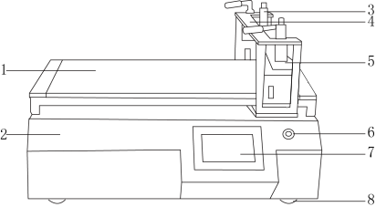
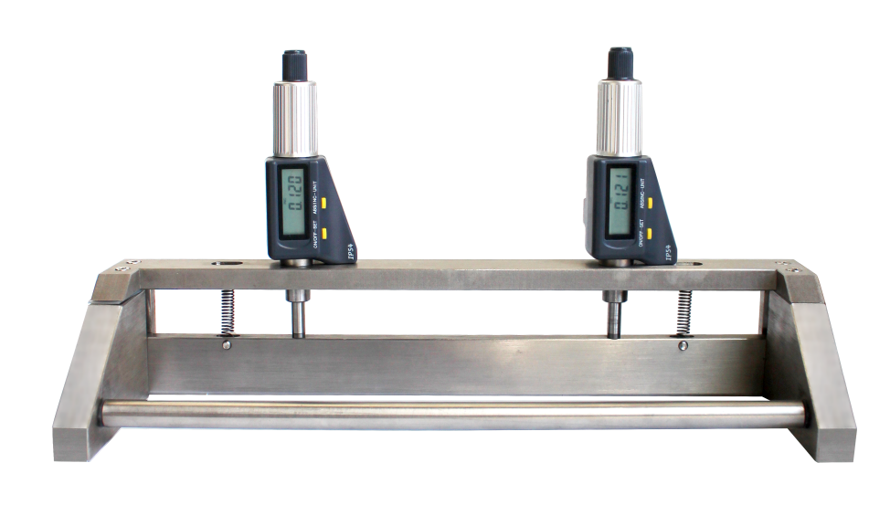
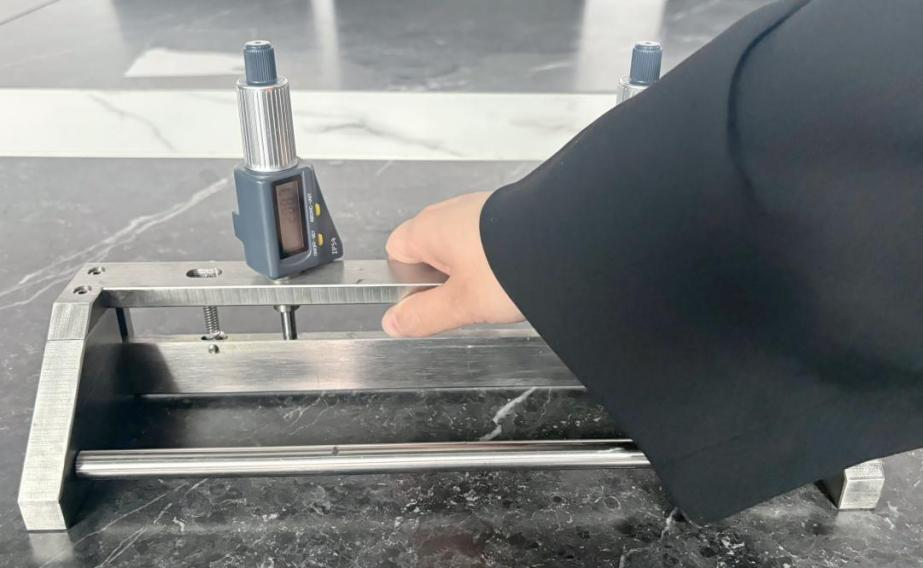
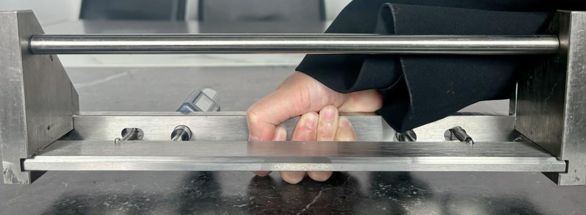

# SP-TM400 Automatic Film Coating Machine

> **SINOPRO** · 문서 번호 SINOPRO-M-SP-TM400 · Rev. 1.0 · 2026. 08.

 (1).png>)


본 매뉴얼은 SP-TM400 Automatic Film Coating Machine의 설치·조작·유지보수 방법을 설명합니다. 장비를 사용하기 전에 **2. 안전 및 주의사항**을 반드시 확인하시기 바랍니다.


## 1. 장치 정보

### 1-1. 장치 개요

실험실용 코팅기는 코팅 속도와 압력 등 작업자에 따른 편차를 최소화하여 균일하고 재현성 높은 코팅 결과를 얻기 위한 장비입니다.

원재료 사용량을 줄이고 실험 조건을 일정하게 유지할 수 있으며, 금속 포일, 접착제, 종이, 필름 등 다양한 소재의 코팅 실험에 사용할 수 있습니다.

**장비 원리 및 특징**

기본 코팅 원리는 다음과 같습니다.

코팅 시스템은 속도 조절 모터, 스크류, 슬라이드 샤프트, 핸들, 어플리케이터, 디지털 마이크로미터 등으로 구성되어 있습니다.

디지털 마이크로미터로 코팅 두께를 조절하고, 설정된 코팅 속도에 따라 어플리케이터가 일정하게 이동하여 균일하게 코팅합니다.

### 1-2. 장치 구성

**제품 구조**

<table><thead><tr><th width="107.75" align="center">번호</th><th>명칭</th></tr></thead><tbody><tr><td align="center">1</td><td>유리판 작업대</td></tr><tr><td align="center">2</td><td>아연도금 판금 커버</td></tr><tr><td align="center">3</td><td>마이크로미터</td></tr><tr><td align="center">4</td><td>기계식 고정 지그</td></tr><tr><td align="center">5</td><td>어플리케이터</td></tr><tr><td align="center">6</td><td>전원 버튼</td></tr><tr><td align="center">7</td><td>터치스크린</td></tr><tr><td align="center">8</td><td>받침대</td></tr></tbody></table>

### 1-3. 장치 사양 및 규격 (TDS)

<table><thead><tr><th width="251.5">항목</th><th>사양</th></tr></thead><tbody><tr><td>코팅 방식</td><td>분리형 조절식 어플리케이터</td></tr><tr><td>어플리케이터 조절 방식</td><td>디지털 마이크로미터</td></tr><tr><td>어플리케이터 정밀도</td><td>±3μm</td></tr><tr><td>어플리케이터 길이</td><td>총 280mm / 유효 길이 250mm</td></tr><tr><td>어플리케이터 재질</td><td>SUS304</td></tr><tr><td>코팅 두께</td><td>0.01~10mm</td></tr><tr><td>코팅 속도</td><td>5~200mm/s (무단 변속)</td></tr><tr><td>유효 코팅 면적</td><td>300 × 400mm</td></tr><tr><td>코팅 거리 설정 범위</td><td>1~400mm (디지털 설정)</td></tr><tr><td>작업대 재질</td><td>10mm 유리판</td></tr><tr><td>기재 고정 방식</td><td>한쪽 기계식 고정 지그</td></tr><tr><td>제어 방식</td><td>터치스크린</td></tr><tr><td>장비 총 소비전력</td><td>150W</td></tr><tr><td>전원</td><td>220V / 50Hz</td></tr><tr><td>외형 치수</td><td>620 × 490 × 410mm (L × W × H)</td></tr><tr><td>장비 중량</td><td>약 55kg</td></tr></tbody></table>

## 2. 안전 및 주의사항

### 2-1. 경고 표지 및 기호 설명


**위험 (DANGER)** — 지시를 따르지 않을 경우 사망 또는 중상으로 이어질 수 있는 임박한 위험 상황입니다.



**경고 (WARNING)** — 지시를 따르지 않을 경우 사망 또는 중상으로 이어질 수 있는 잠재적 위험 상황입니다.



**주의 (CAUTION)** — 지시를 따르지 않을 경우 경상 또는 장비 손상으로 이어질 수 있는 상황입니다.


### 2-2. 작업자 안전 수칙

_(원본 문서에 해당 내용 없음 )_

### 2-3. 설치 환경 주의사항

**사용 환경 및 주의사항**

다음과 같은 환경에서는 장치 사용을 피합니다.

1. 진동이나 흔들림이 발생하는 장소에서는 사용하지 않습니다.
2. 직사광선이 비치는 장소에서는 사용하지 않습니다.
3. 고온, 먼지 또는 습기가 많은 장소에서는 사용하지 않습니다.
4. 안전한 사용을 위해 AC 전원은 반드시 접지된 전원을 사용합니다.
5. 장치 청소 시 벤젠, 니트로계 용제 등 강한 유기용제를 사용하지 않습니다.
6. 전자 부품의 손상 및 감전 위험이 있으므로 장치 내부에 물이나 이물질이 들어가지 않도록 주의합니다.


장치 내부에 물이나 이물질이 들어갈 경우 전자 부품 손상 및 **감전**의 위험이 있습니다.


## 3. 설치 및 운반

### 3-1. 운반 및 이동


장비 중량은 약 **55kg**입니다. 운반 시 2인 이상 또는 운반 장비를 사용하는 것이 안전합니다.


### 장치 설치



## 장치 설치 위치 선정

장치는 진동이 없는 장소에 설치합니다.



## 수평 상태 확인

장치는 평평하고 견고한 작업대에 설치하고, 수평계를 사용하여 수평 상태를 확인합니다.



## 전원 연결 전 확인

전원을 연결하기 전 장치의 전원 스위치가 OFF 상태인지 확인하고, 전원 연결 상태를 점검한 후 전원을 연결합니다.



## 받침대 안정성 확인

장치의 모든 받침대가 작업대에 안정적으로 닿아 있는지 확인합니다. 일부 받침대가 뜬 상태로 사용하지 않습니다.



## 장치 전원 켜기

전원을 연결한 후 전원 버튼을 눌러 장치를 켭니다.



### 3-2. 유틸리티 연결

_(원본 문서에 해당 내용 없음 — 전원 사양은 1-3. 장치 사양을 참조.)_

## 4. 사용 및 조작 방법

### 4-1. 사용 전 준비사항

_(원본 문서에 해당 내용 없음)_

### 4-2. 장비 조작

**장치 설정 및 조작**

장치의 전원을 켜면 터치스크린에 【시작 화면】이 표시됩니다.

 (1).png>)

【시작 화면】을 터치하면 【조작 화면】으로 이동합니다.

 (1).png>)

설정할 항목을 선택하여 값을 입력한 후 【확인】 버튼을 눌러 설정을 완료합니다.

실험 조건에 맞게 각 파라미터를 설정한 후 실험을 진행합니다.

※ 코팅 속도 설정 범위: 5\~200mm/s

### **코팅 유닛 조작 절차 — 어플리케이터 조절 방법**



## 어플리케이터 내리기

한 손으로 어플리케이터를 눌러 기재 위에 위치시킵니다.




## 어플리케이터 높이 조절

어플리케이터를 기재 표면까지 내린 후, 양쪽 마이크로미터 헤드를 시계 방향으로 돌려 어플리케이터가 기재에 밀착되도록 조절합니다.

확인 포인트: 마이크로미터에서 '딸깍' 소리가 5회 이상 나면 어플리케이터가 기재에 밀착된 상태입니다.

이후 마이크로미터 상단의 노란색 【ABS/INC】 버튼을 짧게 눌러 값을 0으로 설정합니다.

※ 참고: 마이크로미터의 회전 조절부는 은색 부분입니다.




## 어플리케이터 코팅 두께 조절

마이크로미터의 은색 회전 조절부를 반시계 방향으로 돌려 원하는 습도막 두께로 설정합니다. 예: 습도막 두께 0.1mm 설정 시 마이크로미터 표시값은 0.100입니다.


※ 주의: 반시계 방향으로 조절할 때 측정축이 끝까지 올라가지 않도록 주의합니다. 마이크로미터가 잠길 경우 수명에 영향을 줄 수 있습니다.


※ 잠긴 경우 상단의 회색 노브를 시계 방향으로 돌려 잠금을 해제합니다. 자세한 방법은 영상을 참고합니다.



## 어플리케이터 올리기

어플리케이터의 가로 프레임을 잡고 들어 올린 후 뒤집어 코팅액을 닦아냅니다.




### 4-3. 사용 후 정리

_(원본 문서에 해당 내용 없음)_

## 5. 유지보수 및 트러블슈팅

### 장치 유지보수



## 장치 청결 유지

장치를 항상 청결한 상태로 유지합니다.



## 장치 표면 청소

장치 표면을 청소할 때 유해 화학물질이나 유기용제 등을 사용하지 않습니다.



## 장치 분해 및 수리

장치의 분해 및 수리는 전문 인력이 적절한 공구를 사용하여 진행합니다.



## 전자 부품 설정

장치에 사용되는 인버터 등 전자 부품은 출고 시 설정이 완료되어 있으므로 임의로 설정을 변경하지 않습니다.



## 습기 방지

장치를 습기가 많은 환경에 보관하거나 사용하지 않습니다.



### 5-1. 정기 점검 항목

_(원본 문서에 해당 내용 없음 )_

### 5-2. 주요 소모품 및 부품 교체

_(원본 문서에 해당 내용 없음 )_

### 5-3. 트러블슈팅

_(원본 문서에 해당 내용 없음 )_

## 6. 기술지원 (A/S)

### 6-1. A/S 접수 절차 및 문의처



## 장비 정보 확인

장비 모델명(SP-TM400)과 **시리얼 번호**를 확인합니다.



## 문의처 연락

이상 현상을 확인한 후 아래 문의처로 연락합니다. 이상 현상 사진/영상을 함께 보내 주시면 처리가 빠릅니다.



| 구분 | 내용 |
| -- | -- |
|    |    |
|    |    |
|    |    |
|    |    |

### 6-2. 품질 보증 기간 및 조건

| 구분  | 기간    |
| --- | ----- |
| 본체  |       |
| 소모품 | 보증 제외 |
