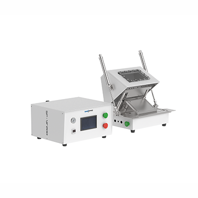
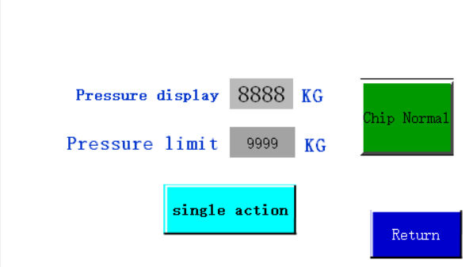
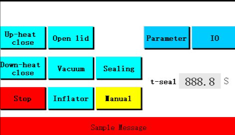
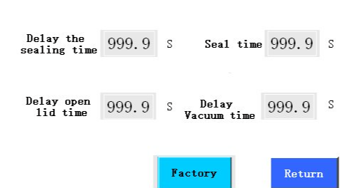

# SP-YF200 Vacuum Pre-sealing Machine

> **SINOPRO** · 문서 번호 SINOPRO-M-SP-YF200 · Rev. 1.0 · 2026. 08.


본 매뉴얼은 SP-YF200 Vacuum Pre-sealing Machine의 설치·조작·유지보수 방법을 설명합니다.

장비를 사용하기 전에 **2. 안전 및 주의사항**을 반드시 읽어 주세요.


## 1. 장치 정보

### 1-1. 장치 개요

SP-YF200 Vacuum Pre-sealing Machine은 전해액 주입 및 정치 공정이 완료된 파우치 셀을 진공 상태에서 예비 실링(Pre-sealing)하기 위한 장비입니다. 진공 챔버 내부에서 셀의 잔류 공기를 제거한 후, 공압식 실링 헤드를 이용하여 알루미늄 라미네이트 필름을 열융착 방식으로 실링합니다.

**핵심 특징**

<table><thead><tr><th width="247">특징</th><th>설명</th></tr></thead><tbody><tr><td>우수한 열전도 및 실링 성능</td><td>실링 헤드에 구리(Copper) 소재를 적용하여 열전도성이 우수하며, 빠르고 안정적인 가열이 가능합니다</td></tr><tr><td>실링 압력 및 구동 제어</td><td>압력 조절 밸브를 통해 실링 압력을 조절할 수 있으며, 실린더와 리니어 가이드 구조를 적용하여 실링 헤드가 안정적으로 상·하 구동됩니다</td></tr><tr><td>안정적인 진공 실링 및 내부 관찰</td><td>실린더 구동 방식으로 챔버 커버가 개폐되며,  투시창을 통해 작업 중 챔버 내부 상태를 확인할 수 있습니다</td></tr><tr><td>다양한 파우치 셀 대응</td><td>다양한 크기의 소형·중형 파우치 셀에 적용할 수 있으며, 제품 규격에 따라 투입 위치를 조정할 수 있습니다</td></tr><tr><td>설치 유연성</td><td>본체·제어박스 분리형 설계로 글러브박스 내 장착 또는 자동화 라인 설치 가능</td></tr><tr><td>사용자 친화적 설계</td><td>터치스크린을 통해 주요 운전 조건을 설정하고 장비를 조작할 수 있습니다.</td></tr><tr><td>오염 방지 설계</td><td>폐액 수집 트레이가 적용되어 작업 중 발생할 수 있는 잔여 전해액을 수집하고 장비 내부의 오염을 줄일 수 있습니다.</td></tr></tbody></table>

주요 구성품 및 옵션 목록

| 구분    | 품목      |  수량 | 비고        |
| ----- | ------- | :-: | --------- |
| 기본    | 본체(작업부) |  1  | —         |
| 기본    | 제어박스    |  1  | 본체 분리형    |
| 별도 준비 | 진공 펌프   |  1  | 주문 및 개별준비 |
| 별도 준비 | 콤프레셔    |  1  | 주문 및 개별준비 |

### 1-2. 장치 구성

장치의 구성은 디스플레이, 진공 챔버, 진공 펌프 3구성으로 이루어 집니다.

### 1-3. 장치 사양 및 규격

<table><thead><tr><th width="301">항목</th><th>사양</th></tr></thead><tbody><tr><td>챔버 재질</td><td>알루미늄 합금 (내식성 우수, 견고한 구조)</td></tr><tr><td>진공도</td><td>-95 kPa까지 조절 가능 (구매자 진공펌프 별도 준비)</td></tr><tr><td>실링 헤드 온도</td><td>상온 ~ 250℃ 조절 가능 (제어 정밀도 ±2℃)</td></tr><tr><td>열실링 압력</td><td>0 ~ 7kg/cm² (조절 가능)</td></tr><tr><td>열실링 시간</td><td>0 ~ 99초 (조절 가능)</td></tr><tr><td>실링 폭/ 최대 길이</td><td>5mm / 200mm</td></tr><tr><td>실링 헤드 평행도</td><td>3매 무탄소 복사지(Carbonless Copy Paper)를 사용하여, 실링 헤드 압력 0.6 MPa 및 온도 200℃ 조건에서 균일한 실링 자국이 형성되어야 함.</td></tr><tr><td>공기 소비량</td><td>약 0.2L 압축 공기 / 1회 실링</td></tr><tr><td>공압 작동 속도</td><td>시간당 180회 이상 (≥180회/h)</td></tr><tr><td>전원 / 소비 전력</td><td>220V·50Hz / 500W 히터, 가열 시 약 1kW</td></tr><tr><td>압축 공기 공급</td><td>0.5 ~ 0.8 MPa</td></tr><tr><td>외형 치수</td><td>작업부 470×485×435mm · 제어박스 420×325×225mm</td></tr><tr><td>장비 무게</td><td>약 50kg</td></tr></tbody></table>

## 2. 안전 및 주의사항

### 2-1. 경고 표지 및 기호 설명


**위험 (DANGER)** — 지시를 따르지 않을 경우 사망 또는 중상으로 이어질 수 있는 임박한 위험 상황.



**경고 (WARNING)** — 지시를 따르지 않을 경우 사망 또는 중상으로 이어질 수 있는 잠재적 위험 상황.



**주의 (CAUTION)** — 지시를 따르지 않을 경우 경상 또는 장비 손상으로 이어질 수 있는 상황.


### 2-2. 작업자 안전 수칙


장비 운전 중에는 손이나 신체 일부를 진공 챔버 내부, 볼 베어링 가이드 또는 위험 작업 구역에 넣는 것을 **금지**합니다.


1. 본 장비는 **1인 조작을 원칙으로 합니다.**\
   안전사고 및 오작동 방지를 위해 여러 작업자가 동시에 장비를 조작하지 마십시오. 장비 작동 시에는 **양손으로 시작 버튼 2개를 동시에 눌러야 작동합니다.**
2. 장비에는 작업자 보호를 위한 **안전장치 및 안전 커버가 설치되어 있습니다.**.
3. 지정된 작업자 및 기술자 외에는 장비를 **임의로 분해, 조정 또는 수리하지 마십시오**.
4. 전기 회로 및 내부 부품을 **임의로 분해, 개조 또는 변경하지 마십시오**.
5. 장비 작동 중 이상 또는 위험 상황이 발생한 경우 **즉시 비상정지(EMO) 스위치를 눌러 장비를 정지하십시오.**
6. 컨트롤 박스 위에 물건을 올려놓지 마십시오.&#x20;
7. 장비 본체 및 구동부 주변에 비닐, 종이 등 가볍거나 구동부에 빨려 들어갈 수 있는 물체를 두지 마십시오.&#x20;

<table><thead><tr><th width="117">구분</th><th>주의 내용</th></tr></thead><tbody><tr><td>고온</td><td>실링 헤드는 최대 250℃까지 가열됩니다. 운전 중·정지 직후 실링 유닛 접촉 금지</td></tr><tr><td>전기</td><td>220V 전원 사용. 점검·정비 전 반드시 전원 차단</td></tr><tr><td>공압</td><td>0.5~0.7MPa 압축 공기 사용. 배관 분리 전 잔압 제거</td></tr></tbody></table>

### 2-3. 설치 환경 주의사항

* **평탄도** — 평탄하고 견고한 바닥에 설치하고 수평 확인
* **환기** — 환기가 잘 되는 장소에 설치
* **유격 거리** — 방열·정비 공간 확보를 위해 장비 주변에 충분한 유격 확보
* **비상정지 버튼 위치** — 제어 패널에 위치. 작업자가 즉시 조작 가능한 배치인지 확인

## 3. 설치 및 운반

### 3-1. 운반 및 이동


장비 무게: 약 50kg — 운반 시 2인 이상 또는 운반 장비를 사용하세요.




### 장비 설치

목재 포장을 제거한 후 장비를 조심스럽게 지정된 위치에 설치합니다.



### 본체 및 제어박스 운반

본체(작업부)와 제어박스는 분리형이므로 각각 운반합니다.



### 3-2. 유틸리티 연결

배관과 전선은 표시된 **식별 코드**에 따라 정확하게 연결합니다.

<table><thead><tr><th width="105">유틸리티</th><th width="150">사양</th><th>연결 방법</th></tr></thead><tbody><tr><td>전원</td><td>220V / 50Hz</td><td>식별 코드에 따라 연결</td></tr><tr><td>압축 공기</td><td>0.5 ~ 0.7MPa</td><td>식별 코드에 따라 연결</td></tr><tr><td>진공</td><td>Φ10 튜브</td><td>진공관으로 연결 (진공 펌프 별도 준비)</td></tr></tbody></table>


**글러브박스 설치 시** — KF40 클램프로 밀봉하고, 에폭시 수지로 실란트 처리합니다.


## 4. 사용 및 조작 방법

### 4-1. 사용 전 준비사항



### 유틸리티 연결 상태 확인

유틸리티(전원·에어·진공) 연결 상태를 확인합니다.



### 제품 투입 위치 조정

배터리(제품) 투입 위치를 정확하게 조정합니다.



### 전원 및 설정값 확인

전원을 켜고 설정값(에어 압력·밀봉 온도·밀봉 시간·진공도·커버 개방 압력)을 확인합니다. **출고 시 기본값이 세팅되어 있습니다.**



**제어 패널 구성**

<table><thead><tr><th width="301">스위치</th><th>기능</th></tr></thead><tbody><tr><td>Up-heat open/ close (상부가열) </td><td>상부 실링 헤드 가열 온/오프 전환</td></tr><tr><td>Down-heat open/ close (하부가열)</td><td>하부 실링 헤드 가열 온/오프 전환</td></tr><tr><td>Stop (비상 정지)</td><td>모든 동작 정지</td></tr><tr><td>Open lid (커버 캐폐)</td><td>챔버 커버 열림/닫힘 전환</td></tr><tr><td>Vacuum (진공)</td><td>진공 밸브 온/오프 전환 (실링 작업 시 열림 상태)</td></tr><tr><td>Inflator (가스 주입)</td><td>가스 주입 밸브 온/오프 전환 (실링 작업 시 닫힘 상태)</td></tr><tr><td>Sealing (실링)</td><td>실링 헤드에어실린더 하강/상승 동작</td></tr><tr><td>Manual/ Auto (수동/자동)</td><td>수동 및 자동 모드 전환 (작업 시 자동 모드 사용)</td></tr></tbody></table>

**파라미터 설정**

| 항목          | 설명                                    |
| ----------- | ------------------------------------- |
| 상부/하부 온도 설정 | 상·하부 실링 헤드의 가열 온도 설정                  |
| 실링 시간       | 상하 실링 헤드의 밀착 유지 시간 설정                 |
| 실링 지연 시간    | 진공도가 설정값(P1) 도달 후 실링까지의 지연 시간         |
| 커버 개방 지연 시간 | 가스 주입 압력이 설정값(P2) 도달 후 커버 개방까지의 지연 시간 |




* 게이지 상단은 **진공 측정값**, 하단은 **진공 설정값**입니다.
* 《파란색 버튼》을 눌러 **P1** 항목이 표시되면 해당 값이 진공 설정값입니다.
* 《UP》《DOWN》으로 원하는 진공 값을 설정합니다.
* 설정 범위: 일반적으로 **-85kPa \~ -90kPa**
* 챔버 내부 진공도가 설정값에 도달하면 신호가 출력되어 다음 공정이 자동으로 시작됩니다.



* 《파란색 버튼》을 눌러 P1이 표시된 후 **P2**가 표시되면, P2 값이 보충 압력 설정값입니다.
* 《UP》《DOWN》으로 원하는 압력을 설정합니다.
* 설정 범위: 일반적으로 **-3kPa \~ 0kPa**
* 보충 압력이 설정값에 도달하면 신호가 출력되어 상부 커버 개방 공정이 시작됩니다.



### 4-2. 장비 조작



### 자동 모드 전환

**수동 모드를 자동 모드로 전환**합니다.



### 제품 투입

온도가 설정값에 도달하면 제품을 투입합니다.



### 시작 버튼 조작

양손으로 장비 전면 하단 좌우의 **시작 버튼을 동시에** 누릅니다.



### 커버 하강 및 진공 환경 형성

상부 커버가 자동으로 하강하여 하판의 O링을 눌러, 제품이 진공 밀봉된 환경에서 작업되도록 합니다.



### 진공 및 밀봉 시작

자동으로 진공이 시작되며, 설정된 진공도(P1)에 도달하면 밀봉이 시작됩니다.



### 실링 수행

히터가 하강하여 밀봉을 수행하며, 타이머가 작동되어 설정된 시간만큼 밀봉이 진행됩니다.



### 진공 해제

밀봉 완료 후 챔버 내부에 가스를 주입하여 진공을 해제합니다.



### 제품 회수

챔버 내부 압력이 설정값(P2)에 도달하면 커버가 자동으로 열리고, 제품을 꺼내면 작업이 완료됩니다.




운전 중에는 챔버 내부와 동작부에 손을 넣지 마세요. 이상 발생 시 즉시 **비상 정지** 버튼을 누르세요.


### 4-3. 사용 후 정리



### 수동 모드 전환

자동 모드를 수동 모드로 전환합니다.



### 가열 종료

상·하부 가열 스위치를 끄고 히터가 식을 때까지 기다립니다.



### 시료 회수

시료(제품)를 모두 회수합니다.



### 전원 및 공기 공급 차단

전원을 끄고 압축 공기 공급을 차단합니다.



### 장비 청소

상하 플레이트와 진공 챔버를 닦고, 폐액 수집 트레이를 비웁니다.



## 5. 유지보수 및 트러블슈팅

### 5-1. 정기 점검 항목



| 항목    | 내용                       |  확인 |
| ----- | ------------------------ | :-: |
| 챔버 청소 | 상하 플레이트와 진공 챔버를 닦아 청결 유지 |  ☐  |
| O링 상태 | 실링 고무링 장착 및 손상 여부 확인     |  ☐  |
| 공압 압력 | 0.5\~0.7MPa 범위 확인        |  ☐  |



| 항목    | 내용                      |  확인 |
| ----- | ----------------------- | :-: |
| 급유    | 베어링과 운동 부위에 오일 주입       |  ☐  |
| 체결 상태 | 볼트·너트·핀 고정 상태 점검, 풀림 방지 |  ☐  |



| 항목       | 내용                       |  확인 |
| -------- | ------------------------ | :-: |
| 방청 처리    | 동작 부위를 깨끗이 닦고 표면에 방청유 도포 |  ☐  |
| 전기 안전 점검 | 절연·접지 상태 확인              |  ☐  |



### 5-2. 주요 소모품 및 부품 교체

| 부품 명칭      | 용도       | 권장 교체 주기   | 비고             |
| ---------- | -------- | ---------- | -------------- |
| 실링 고무링(O링) | 챔버 진공 밀봉 | 손상 시 즉시 교체 | 진공 불량의 주요 원인   |
| 히터(실링 나이프) | 열 밀봉     | 이상 시 교체    | 500W           |
| 무탄소 복사용지   | 평행도 점검용  | 점검 시 사용    | 0.6MPa·200℃ 기준 |


**실링 헤드 평행도 조정** — 상하 히터 날이 평행하지 않아 실링 불량이 발생하는 경우, 상단 히터의 조정 나사로 평행도를 조정합니다. 무탄소 복사용지를 눌러 밀봉 흔적이 고르게 나타나는지 확인합니다.


### 5-3. 트러블슈팅

<table><thead><tr><th width="76" align="center">번호</th><th width="156">이상 현상</th><th>원인</th><th>조치 방법</th></tr></thead><tbody><tr><td align="center">1</td><td>진공이 안 되거나 설정값에 도달하지 않음</td><td>
① 진공펌프 미작동

② 직통밸브 미개방

③ 진공밸브 미개방

④ 보충밸브 미폐쇄

⑤ 실링 고무링 미장착·손상
</td><td>
① 진공펌프 작동

② 직통밸브 개방

③ 수동 모드에서 진공밸브 개방

④ 수동 모드에서 보충밸브 닫기

⑤ O링 재장착 또는 교체
</td></tr><tr><td align="center">2</td><td>커버가 닫히지 않음</td><td>
① 히터 온도 미도달

② 공압 압력 부족

③ 실린더 미작동
</td><td>
① 온도 도달까지 대기

② 공압 라인·압력 확인 (0.6MPa)

③ 릴레이·솔레노이드밸브 작동 확인
</td></tr><tr><td align="center">3</td><td>커버가 열리지 않음</td><td>
① P2 값이 너무 큼

② 공압 미작동·압력 부족

③ 실린더 미작동
</td><td>
① P2 값을 -2.0 미만으로 설정

② 공압 라인·압력 확인 (0.6MPa)

③ 릴레이·솔레노이드밸브 작동 확인
</td></tr><tr><td align="center">4</td><td>실링 불량</td><td>
① 히터 온도 낮음

② 실링 시간 짧음

③ 상하 히터 날 비평행
</td><td>
① 온도 상향 (예: 180℃)

② 시간 연장 (예: 3초 이상)

③ 조정 나사로 평행도 조정
</td></tr></tbody></table>


문제가 해결되지 않으면 **6. 기술지원 (A/S)** 으로 문의해 주세요.


## 6. 기술지원 (A/S)

### 6-1. A/S 접수 절차 및 문의처



### 장비 정보 확인

장비 모델명(SP-YF200)과 **시리얼 번호**를 확인합니다.



### 1차 확인

**5-3. 트러블슈팅**과 대조하여 1차 확인합니다.



### 기술지원 문의

해결되지 않는 경우 아래 문의처로 연락합니다. 이상 현상 사진/영상을 함께 보내 주시면 처리가 빠릅니다.



| 구분 | 내용 |
| -- | -- |
|    |    |
|    |    |
|    |    |
|    |    |
|    |    |
|    |    |

### 6-2. 품질 보증 기간 및 조건

| 구분             | 기간    |
| -------------- | ----- |
| 본체             |       |
| 소모품 (O링, 히터 등) | 보증 제외 |

보증 조건 상세

* 정상 사용 중 발생한 고장: 무상 수리
* 유상 처리 대상:
  * 사용자 임의 분해·개조 또는 지정되지 않은 인원의 수리
  * 매뉴얼에 명시된 사용 환경·유틸리티 조건을 벗어난 사용
  * 천재지변 등 외부 요인에 의한 손상

> **SINOPRO CO., LTD.** · _Solution For Battery RND & Manufacture_\
> F625–626, F642–645, 43, Bogyongdong-ro, Yuseong-gu, Daejeon, Republic of Korea (34202)\
> **Tel** +82-42-721-7277 · **A/S Center** 070-7537-0075\
> **실험실장치** [Tech-Support@sinopro.co.kr](mailto:Tech-Support@sinopro.co.kr) · **충방전기** [TS@sinopro.co.kr](mailto:TS@sinopro.co.kr) · [www.sinopro.co.kr](https://www.sinopro.co.kr/)
